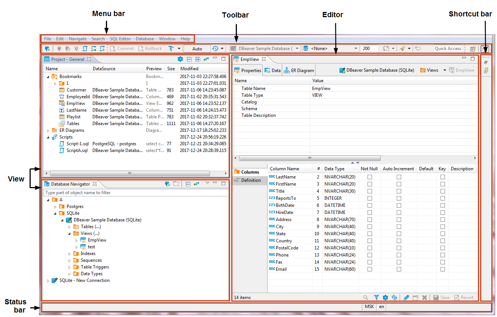
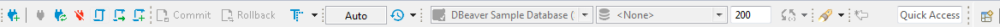
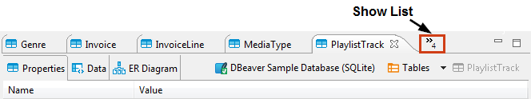
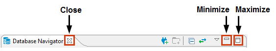
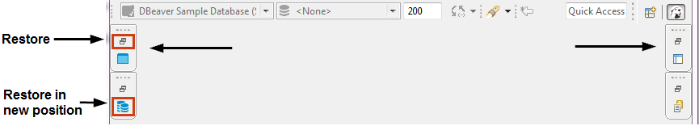

The DBeaver window contains a menu bar, a toolbar, a shortcut bar, a workspace with one or more editors and views, and a status bar:

# Menu Bar
By default, the menu bar contains the following menus:

* **File** menu contains menu items for the creation of files, folders, projects, database connections, database projects, and ER diagrams as well as Import and Export items.  
* **Edit** menu contains global commands like Cut, Copy, Paste, and Delete targeted at the active element.
* **Navigate** menu allows navigating through scripts and database objects.
* **Search** menu provides options to search among files, database objects and across data.
* **SQL Editor** menu is for opening SQL Editor and managing its appearance.
* **Database** menu allows managing database drivers, connections and transactions as well as reconnecting to and disconnecting from a database.
* **Window** menu includes items to manage the look of DBeaver window: show/hide and minimize/maximize views and editors, display bars, split editors, and manage other preferences.
* **Help** menu contains links to information and help resources, as well as menu items to check the version number and availability of updates.

You can customize the menu bar and the list of menu items to display, for this, go to **Window -> Customize Perspective -> Menu Visibility** tab.

# Toolbar
The toolbar contains buttons for basic and most frequently used commands:

Some of the buttons are enabled (colored), others are disabled (greyed). The sets of enabled and disabled buttons change depending on which editor is currently active in the workspace. Only enabled buttons are applicable to the active view or editor.

You can customize the toolbar, for this, go to **Window -> Customize Perspective -> Tool Bar Visibility** tab. 

You can hide or show the toolbar in the application window. To do it, on the Window menu, click **Appearance -> Hide  Toolbar / Show Toolbar**.

# Shortcut Bar
There are two shortcut bars - on the left and on the right side of the workspace zone. Shortcut bars host shortcuts of views and editors and appear if at least one view or editor is minimized, otherwise they are hidden.

# Workspace: Views and Editors
Views are windows within the workspace that provide presentations and ways to navigate the information. For more information about particular views, see [Views](https://github.com/dbeaver/dbeaver/wiki/Views) article.

Editors are windows in which you can interact with the content of files and databases. For more information about particular editors, see [Editors](https://github.com/dbeaver/dbeaver/wiki/Editors) article.

Both views and editors can appear as separate windows or as tabs stacked with other views/editors in a tabbed window. The following image shows the title bar of a tabbed window. If tabs do not fit in the title bar of a tabbed window, they become hidden. To see the list of hidden tabs, click the Show List icon that also indicates their number:

There can be several views and editors simultaneously open in the workspace but only one of them can be active at a time.

You can change the layout of the workspace by opening and closing views, docking them in different positions in the workspace, collapsing them to the shortcut bar, or expanding them to occupy the whole workspace and restoring to the latest docked position.  

## Changing Workspace Layout
You can move views and editors around the workspace and dock them in different positions:
* As a tab in a tabbed window
* As a separate window with a vertical or horizontal layout in any zone of the workspace

You can also swap locations of two views or editors.

To dock a view to a position in the workspace, press and hold the title bar of the view, then drag and drop it onto the desired position. 

You can resize the view and editor windows. To resize, place the cursor to the border of the window to see it change to a double-ended arrow, then click and drag the border to the needed size.

To close a view or editor, click the Close button or right-click the title bar of the view / editor and then click one of the options on the context menu (they change depending on the configuration of windows):
* **Close** - to close the active window or tab in a tabbed window
* **Close Others** (for editors and views that appear as tabs in tabbed windows) - to close all tabs of the current tabbed window except the active tab
* **Close Tabs to the Right / Left** (also for tabbed windows) - to close all tabs of the current tabbed window that are located to the right / left of the active tab
* **Close All** - to close all tabs of a tabbed window (close the window)

## Maximizing, Minimizing and Restoring View and Editors
All views and editors have the Close, Minimize and Maximize buttons: 

The Maximize button changes to the Restore button when a view or editor is maximized.

To maximize a view or editor to the size of the whole workspace, do one of the following:
* Click the Maximize button in the upper-right corner of the view.
* Double-click the title bar of the view or editor.
* On the Window menu, click **Appearance -> Maximize Active View or Editor**.

When one view is maximized, other views and editors appear as shortcuts on the shortcut bar.

To restore a maximized view or editor to its latest docked position, double-click its title bar or click the Restore button in its upper-right corner. 

When you minimize a view, it wraps into a shortcut on the shortcut bar:

The shortcuts of views and editors may appear on the left or on the right shortcut bar depending on the latest docked position of the view or editor.

To minimize a view, do one of the following:
* Click the Minimize button in the upper-right corner of the view.
* On the Window menu, click **Appearance -> Minimize Active View or Editor**.

To restore a minimized view or editor to its previous position, click the Restore button on its shortcut in the shortcut bar. To restore a minimized view or editor to a new position, click the view / editor name button under the restore button. 
