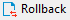
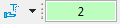
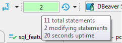
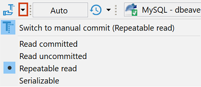

DBeaver supports two modes for committing changes to the database:
* **Auto-commit** transfers all changes that you make immediately to the database.
* **Manual commit** requires your confirmation before committing a change to the database or rolling it back.

Though available in many cases, the two modes are actionable only in [SQL Editor](https://github.com/dbeaver/dbeaver/wiki/SQL-Editor). See the next sections for details of using the modes.

To switch between the modes, use the mode selection button that appears in one of the two views:  or .

## Auto-Commit Mode
Auto-commit mode is the default one for the Development and Test connection types, see [Connection Types](https://github.com/dbeaver/dbeaver/wiki/Connection-Types). Auto-commit mode is on if you can see the auto-commit view of the mode selection button ( in the application toolbar. If you see the manual commit view (), then in order to switch to auto-commit mode, click the mode selection button – it changes to auto-commit. At the same time, this disables the two manual commit buttons in the toolbar: **Commit** and **Rollback** – these are available only in manual commit mode.

The statistics field next to the mode selection button always shows **Auto** in auto-commit mode: .

Clicking the statistics field opens the [Transaction Log](https://github.com/dbeaver/dbeaver/wiki/Transaction-Log).

## Manual Commit Mode
Manual commit is intended to protect your database from inadvertent changes and that is why it is the default mode for Production connection type, see [Connection Types](https://github.com/dbeaver/dbeaver/wiki/Connection-Types).

Manual commit mode is on if you can see the Manual commit view of the mode selection button ( in the application toolbar. If you see the auto-commit view (), then in order to switch to manual commit mode, click the auto-commit button – it changes to manual commit. At the same time, this enables the two manual commit buttons in the toolbar: **Commit** ( and **Rollback** ().

In manual commit mode, when you execute SQL statements (<kbd>Ctrl+Enter</kbd>), the number of database modifying statements that pend commitment to the database appears in the statistics field next to the mode selection button: .

If you hover you mouse over the field, you can see statistics of your SQL statements:

To commit statements to the database, click the **Commit** button in the toolbar. To discard them, click **Rollback**.

If no modifying statements have been made, the statistics field shows **None**: 
 
Clicking the statistics field opens the [Transaction Log](https://github.com/dbeaver/dbeaver/wiki/Transaction-Log).

## Transaction Isolation Level
For both, Auto and Manual commit modes, you can select the transaction isolation level. To do so, click the arrow next to the mode icon and then click the required option in the dropdown list:

