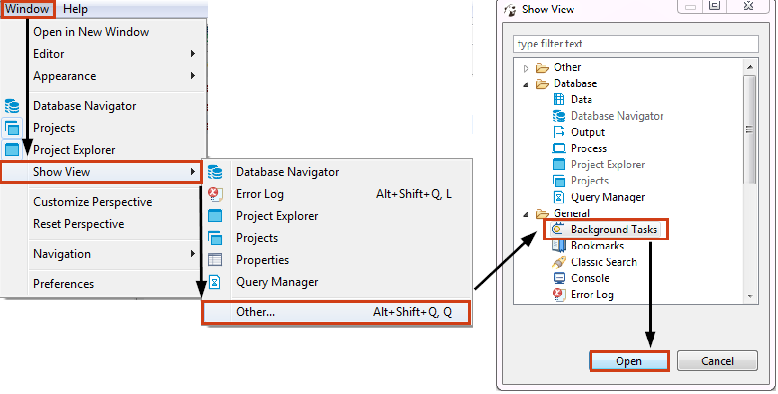
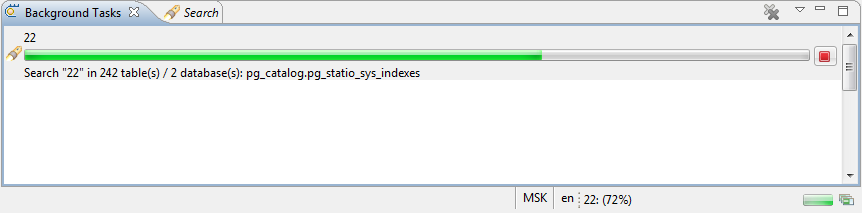
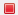

You can open the Background view from the main menu - click **Window -> Show View -> Other**, then in the Show View window, expand the **General** folder, click **Background Tasks** and then click **Open**:

You can also open the Background Tasks view from some other views or editors using a special button, for example from the [Search](https://github.com/dbeaver/dbeaver/wiki/Search) view. 

The Background Tasks view shows the progress of such background tasks as search, SQL query execution, etc. The view shows data when background tasks take some noticeable time and is useful when you want to track the progress of lengthy operations. If you open this view at a short task, the view will be empty.

You can cancel the task in progress - click the **Cancel Operation** button ().