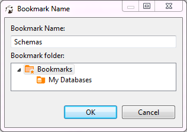

Bookmarks are quick access links to objects of a database. They appear in the project tree inside the [Projects](https://github.com/dbeaver/dbeaver/wiki/Projects-View) or [Project Explorer](https://github.com/dbeaver/dbeaver/wiki/Project-Explorer) views.

To create a bookmark:
1. In the [Database Navigator](https://github.com/dbeaver/dbeaver/wiki/Database-Navigator) or under **Connections** node of the Projects view, click the database object of interest to set focus on it.
2. Press <kbd>CTRL+d</kbd>. The **Bookmark Name** dialog box appears.
3. In the **Bookmark Name** field, enter the bookmark name, then in the **Bookmark folder** field, click the folder, and then click **OK**:  

   

   The bookmark appears in the selected folder of the related project.

To open an object using its bookmark, double-click the bookmark or right-click it and click **Open Bookmark** on the context menu. You can rename and delete bookmarks using the context menu as well. 
