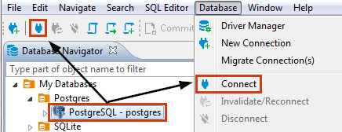

To be able to work with the content and structure of a database, you need to connect to it. When you create a new connection to a database, DBeaver automatically connects to the new database, see [Create Connection](https://github.com/dbeaver/dbeaver/wiki/Create-Connection).

To connect to a database using an existing connection, in the [Database Navigator](https://github.com/dbeaver/dbeaver/wiki/Database-Navigator) or [Projects](https://github.com/dbeaver/dbeaver/wiki/Projects) view, click the connection and then click the Connect button in the toolbar or click **Database -> Connect** on the main menu:

You can also right-click the connection and click **Connect** on the context menu.

If a database connection exists but DBeaver is not connected to the database, the connection appears with its original icon (for example, . When DBeaver connects to the database, the icon changes to signal the connected status: .

If DBeaver cannot connect to a database, the connection appears with an error sign: . If you attempt to connect to such a database, DBeaver displays an error message describing the cause for the error.