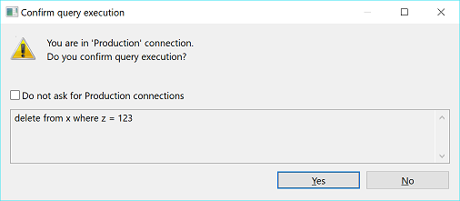
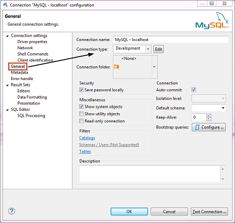
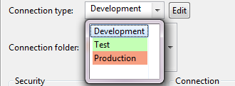
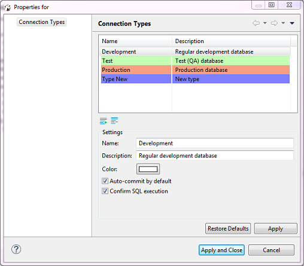
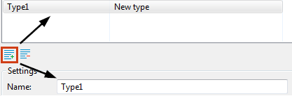

Connection types define how DBeaver behaves regarding:
* Default transactions commit mode - with or without automatic commit of changes to the database.

  NOTE: You can override the default commit behavior during your work with connections by changing the commit mode, see [Auto and Manual Commit Modes](https://github.com/dbeaver/dbeaver/wiki/Auto-and-Manual-Commit-Modes).  

* SQL statements execution (with or without user confirmation). If set to require user confirmation for SQL execution, DBeaver shows a confirmation message every time you attempt to execute a ‘transaction’ type of query (INSERT/DELETE/UPDATE, etc.):

  

For your convenience, DBeaver supports color-coding of connection types so that you know at once which behavior to expect when you use a certain connection. Colored are database connections that use a certain connection type in the [Database Navigator](https://github.com/dbeaver/dbeaver/wiki/Database-Navigator) and [Projects](https://github.com/dbeaver/dbeaver/wiki/Projects) views as well as editors related to these connections:

To manage connection types for a database connection, in the Database Navigator or Projects view, click the connection to set focus to it and then press <kbd>F4</kbd> to open the connection properties window. Then, in the properties window, in the navigation pane on the left, click **General** to see the general settings. You can see **Connection Type** field among the settings:

There are three default connection types – **Development**, **Test**, and **Production**. You can change the connection type for your database connection as well as you can create a new connection type, edit or delete an existing one.

### Change Connection Type
By default, the **Development** connection is preset for all database connections. You can change the connection type to one of the default connection types or to a custom type, if there are any.

To change the connection type:
1. In the connection properties window, on the **General** page, click the **Connection type** field and then click the connection type in the dropdown list:

     
 
2. To test the connection, click **Test Connection**. To confirm the change, click **OK**.

### Create Connection Type
To create a connection type:
1. In the connection properties window (<kbd>F4</kbd>  on a connection), on the **General** page, click **Edit** next to the **Connection type** field. The Properties for connection types window opens:

     

   The window displays existing connection types and their settings.  
2. Click the new connection type button. A new connection type appears in the list:
     
3. Now you can specify the settings for the new connection type:
   * Enter the connection type`s name into the **Name** field. 
   * Enter a description into the **Description** field, if needed. 
   * Click the **Color** box and select the color for the new connection type.  
   * To set DBeaver to automatically commit changes to the database when connections use this connection type, select the **Auto-commit by default** checkbox. Otherwise, leave it empty. 
   * To set DBeaver to ask for your confirmation at each execution of SQL statement of ‘transaction’ type, select the **Confirm SQL execution** checkbox. Otherwise, leave it empty.  
4. Click **Apply** to apply the changes and keep the window open or click **Apply and Close** to apply the changes and close the window. To discard all changes and return to the previous state, click **Restore Defaults**.

### Edit Connection Type
To edit a connection type:
1. In the connection properties window (<kbd>F4</kbd>  on a connection), on the **General** page, click **Edit** next to the **Connection type** field.
2. Specify the settings for the new connection type the same way as when you create a connection type, see 'Create Connection Types' section above.
3. When you finish editing the connection types, click **Apply** to apply the changes and keep the window open or click **Apply and Close** to apply the changes and close the window. To discard all changes and return to the previous state, click **Restore Defaults**.

### Delete Connection Type
To delete a connection type:
1. In the connection properties window (<kbd>F4</kbd> on a connection), on the **General** page, click **Edit** next to the **Connection type** field. The Properties for connection types window opens.
2. In the Properties window, in the list of connection types, click the connection type to set focus to it and then click the delete button under the list: 
3. Click **Yes** in the confirmation dialog box to confirm the deletion. Otherwise, click **No**.
4. Click **Apply** to apply the changes and keep the window open or click **Apply and Close** to apply the changes and close the window.

