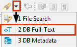
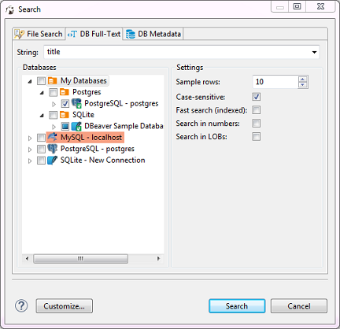

To do full text search in the database contents, click the arrow next to the Search icon in the main toolbar and then click **File Search** on the dropdown menu:

Alternatively, you can click the **Search** button on the main menu and then click the **DB Full-Text** tab in the Search window:

Now you need to choose the database connection or database objects against which to run the search – expand the tree in the **Databases** field to the database connections level or further down and select the checkboxes next to the required connections or database objects.  
NOTE: The **Search** button is enabled only when you select the right level of checkboxes – database connections or lower nodes.

You can apply case-sensitive search, fast search and search in numbers and LOBs.

After you click **Search**, the results open in a [Search](https://github.com/dbeaver/dbeaver/wiki/Search) view:

Double-clicking a row in the Search view opens the respective object in a dedicated [Database Object editor](https://github.com/dbeaver/dbeaver/wiki/Database-Object-Editor).