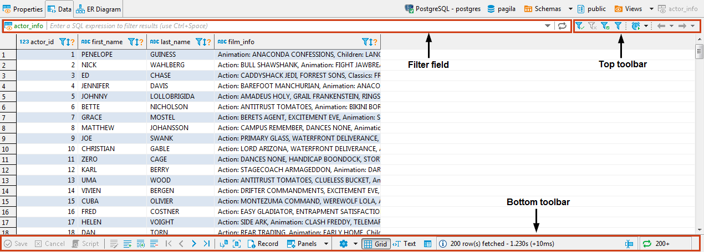
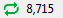
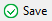
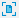
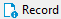
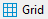
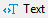

The Data editor appears:
* As the **Data** tab of the [Database Object Editor](https://github.com/dbeaver/dbeaver/wiki/Database-Object-Editor) available only for tables and views.
* As the **Results** tab when you run a custom SQL query in [SQL Editor](https://github.com/dbeaver/dbeaver/wiki/SQL-Editor)

The Data editor allows viewing and editing the data of a database table or view.
The central part of the Data editor is the data table. The editor also provides two toolbars and a filter field:

To learn how many rows the data table contains, click the **Calculate total row count** button in the bottom toolbar. The number of rows appears in a status field next to the button: 

To learn about ways to navigate data in the data table, see [Navigation](https://github.com/dbeaver/dbeaver/wiki/Navigation) article.

The top toolbar contains the following buttons:

Button|Name|Description
------|----|-----------
|**Apply filter criteria**|Applies filter criteria entered in the filter field above the data table, see [Data Filters](https://github.com/dbeaver/dbeaver/wiki/Data-Filters) article for more information
|**Remove all filters/orderings**|Removes all filters and orderings applied to the data
|**Save filter settings for current object**|Saves the current filter settings for the database object to apply next time when you reopen it in the editor, see details in [Data Filters](https://github.com/dbeaver/dbeaver/wiki/Data-Filters) article
|**Custom Filters**|Opens the Result Set Order/Filter Settings window, see [Data Appearance](https://github.com/dbeaver/dbeaver/wiki/Data-Appearance) article for more information
|**Configure auto-refresh**|Allows configuring data auto-refresh settings, see [Data Refresh](https://github.com/dbeaver/dbeaver/wiki/Data-Refresh) article for details
|Forward and backward -  history navigation buttons|Navigate forward and backward in the Data Editor history, see _History_ section of [Navigation](https://github.com/dbeaver/dbeaver/wiki/Navigation) article for more information. The buttons are equivalent to pressing the key combinations: <kbd>Alt+Left</kbd> (backward) and <kbd>Alt+right</kbd> (forward).

The bottom toolbar provides the following buttons:

Button|Name|Description
------|----|-----------
|**Save**|Saves all unsaved changes to the data such as adding, duplicating, deleting rows, inline editing of values, see [Data Viewing and Editing](https://github.com/dbeaver/dbeaver/wiki/Data-Viewing-and-Editing) article for information
|**Cancel**|Discards all unsaved changes to the data
|**Script**|Opens the Preview Changes window in which you can see changes that you have made to the data, see details in [Data Viewing and Editing](https://github.com/dbeaver/dbeaver/wiki/Data-Viewing-and-Editing) article
|**Edit cell value in separate dialog/editor**|Opens the cell in focus for editing in a separate editor or dialog box, see details in _Cell Editor_ section of [Data Viewing and Editing](https://github.com/dbeaver/dbeaver/wiki/Data-Viewing-and-Editing) article
|**Add new row**|Adds a new empty row below the current row, see details in _Adding, Copying and Deleting Rows_ section of [Data Viewing and Editing](https://github.com/dbeaver/dbeaver/wiki/Data-Viewing-and-Editing) article
|**Duplicate current row**|Copies the current rows and pastes the copy below the current row, see details in _Adding, Copying and Deleting Rows_ section of [Data Viewing and Editing](https://github.com/dbeaver/dbeaver/wiki/Data-Viewing-and-Editing) article
|**Delete current row**|Colors the rows in focus in red to mark them for deletion, see details in _Adding, Copying and Deleting Rows_ section of [Data Viewing and Editing](https://github.com/dbeaver/dbeaver/wiki/Data-Viewing-and-Editing) article
|**Move to first row**|Moves the focus (highlighting) from the current to the first row of the table
|**Move to previous row**|Moves the focus (highlighting) from the current to the previous row of the table
|**Move to next row**|Moves the focus (highlighting) from the current to the next row of the table
|**Move to last row**|Moves the focus (highlighting) from the current to the last row of the table
|**Fetch next page of results**|Fetches the next portion of data (next N rows) making it ready for display, see _Scrolling Results Page_ section of [Navigation](https://github.com/dbeaver/dbeaver/wiki/Navigation) article for more information
|**Fetch all rows**|Fetches the whole result set making it ready for display, see _Scrolling Results Page_ section of [Navigation](https://github.com/dbeaver/dbeaver/wiki/Navigation) article for more information
|**Record**|- Same as pressing <kbd>Tab</kbd> - Switches the positions of rows and columns so that columns appear as rows, and rows hide in one **Value** column, see details in the _Table vs. Record Views_ section of [Data Appearance](https://github.com/dbeaver/dbeaver/wiki/Data-Appearance) article
|**Panels**|Opens panels on the right side of the Data Editor, see [Panels](https://github.com/dbeaver/dbeaver/wiki/Panels) for information
|**Configure**|Opens a dropdown menu with settings
|**Grid**|Switches to grid view of data
|**Text**|Switches to plain text view of data
|**JSON**|- Available in EE version only for MongoDB documents and JSON tables - Switches to JSON view of data
|**XML**|- Available in EE version only for XML tables - Switches to XML view of data
|**Generate Mock Data**|Opens the Mock Data Generator window, see TBD for details
|Rows count details|Opens the Status details dialog box showing the timing details of fetching table rows
|**Calculate total row count**|Calculates the total number of rows in the table

Every cell in the data table has a context menu – right-click the cell to open the menu. The context menu provides the following items:

Menu Item|Description
---------|-----------
**Cut**|Cuts the content of the current cell or column to the clipboard
**Copy**|Copies the content of the current cell or column to the clipboard
**Advanced Copy**|Opens advanced copy submenu that allows copying data with preset formatting parameters 
**Paste**|Pastes the copied content to the cells in focus
**Advanced Paste**|Pastes several values delimited with a tabulation or line break
**Delete**|Deletes the row that has the cell in focus  NOTE: In fact, when users click **Delete**, the system only highlights the row red while the actual deletion happens when users click **Save**.
**Edit cell**|-	For CLOB/BLOB data format, opens the contents of the cell in a new tab  - For all formats except CLOB/BLOB, opens a properties window for the cell 
**Inline edit**|- Same as double-click on a cell - Makes the cell editable
**Set to NULL**|Sets the value of selected cells to NULL
**Hide column**|Hides the column currently in focus, see the Managing Display of Columns in Data Table section further in this article
**Save to file…**|- Appears only for columns with BLOB/CLOB data - Opens the standard Save As window that allows saving data contained in the cell to a file 
**Load from file…**|- Appears only for columns with BLOB/CLOB data - Opens a standard window for opening files
**Order/Filter**|Displays a submenu that allows selecting filter criteria for the data. The submenu contains the most common filters that can be applied to the cell in focus – see details in [Data Filters article](https://github.com/dbeaver/dbeaver/wiki/Data-Filters).  By default, DBeaver filters data by sending a request to the server (the Server-side results ordering checkbox selected). To filter data on the client side using DBeaver`s internal algorithm, clear the checkbox.
**View/Format**|Opens a submenu that provides tools for formatting and modifying the view of data, see [Data View and Format](https://github.com/dbeaver/dbeaver/wiki/Data-View-and-Format)
**Navigate**|Opens a submenu that helps users navigate throughout the data table, see [Navigation](https://github.com/dbeaver/dbeaver/wiki/Navigation)
**Layout**|Changes the layout of data, see the _Table vs. Record Views_ section of the [Data View and Format](https://github.com/dbeaver/dbeaver/wiki/Data-View-and-Format) article
**Export Resultset**|Opens the Data Transfer wizard that guides you through the steps to select a format and export data NOTE: The system exports the whole result set including records that are not visible in the screen and preserves all applied data filters and ordering.
**Generate SQL**|Opens a submenu on which you can select the type of SQL query to generate
**Refresh**|Refreshes the whole results set including all items that are not visible in the screen

For more information about using the Data Editor, please see the subsections of this article - open them via the contents tree on the right.