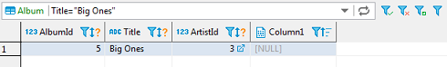
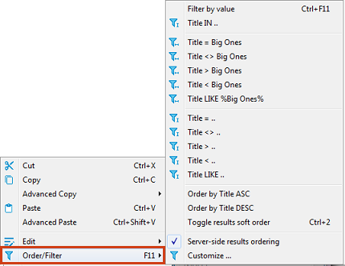
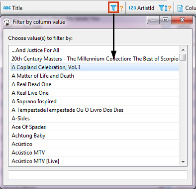

You can apply custom filters to any table contents or query results. There are several ways in which you can filter data in the table.

One of the ways is to use the filter field above the table next to the top toolbar. To filter data, enter an SQL expression into the field and click the Apply filter criteria button () next to the field or press <kbd>Enter</kbd>.

 
You can apply ready-to-use SQL expressions or SQL expression templates via the context menu. To select a ready SQL expression or a template, press <kbd>F11</kbd> or right-click the cell, then click **Order/Filter** on the context menu and then click one of the expressions.

 
The third way is to filter data by a cell value using the filter icon in the column header. To filter data this way, click the filter icon in the column header and then double-click the cell value in the Filter by column value dialog box:

The data updates dynamically. To remove a filter, click the Remove All Filters/Orderings button () in the top toolbar of the editor.

You can save the current filter settings for the database object to apply next time when you reopen it in the editor. To save the current filter settings, click the Save filter settings for current object button () in the top toolbar.
