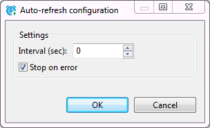
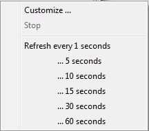

Refresh is necessary if the database contains changes made by other users working on it simultaneously with you and you want to see them in your DBeaver window. To refresh data manually, right-click anywhere in the data table and click **Refresh** on the context menu or press <kbd>F5</kbd>.

You can also schedule auto-refresh to happen on a regular basis. To auto-refresh the database on schedule:
1. Click the Configure auto-refresh button () on the top toolbar of the editor. The Auto-refresh configuration dialog box opens:

     

   a) Set **Interval** in seconds.  
   b) Select the **Stop on error** checkbox if you want the refresh to stop when it encounters an error or clear it, if the refresh should ignore errors.  
   c) Click **OK**. 

2. Alternatively, click the arrow next to the Configure auto-refresh button () to open the auto-refresh menu:

     

   On the menu, you can click one of the preset options or click **Customize** to open the Auto-refresh configuration dialog box, see option 1.  

When you perform either of the two alternative options above, the system starts refreshing the data as scheduled and the Configure auto-refresh button changes to **Stop auto-refresh** button ().  To stop the auto-refresh, click the **Stop auto-refresh** button or click the arrow next to it and click **Stop** on the auto-refresh menu.
