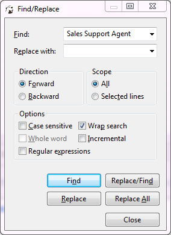

To search for data in the result set, press <kbd>CTRL+F</kbd>. The standard Find/Replace search dialog box opens:

 
You can also use the Find and Replace feature.

NOTE: The system searches only in already fetched rows.
