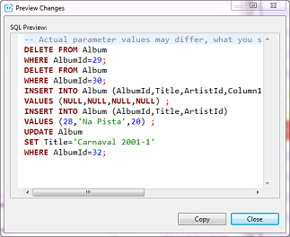
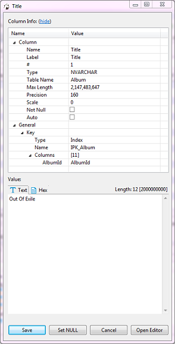
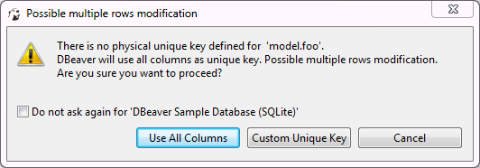
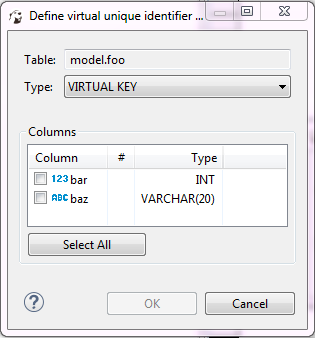

You can do inline editing (see the _Inline Editing_ section below) as well as open the content of a cell in a separate editor (see the _Cell Editor_ section below). 

When you make any changes to the data and save them using steps described in this section, the changes apply to the database itself. Prior to saving the changes, you can preview the SQL script that the system sends to the database to apply the changes there. To see the SQL script, after making changes and before saving or discarding them, click the **Script** button () in the bottom toolbar. The Preview Changes window opens, in which you can only view the SQL script and copy it, if necessary:

## Inline Editing

Inline editing is when you modify the content right in the cell. To edit a cell inline, in the table do one of the following:
* Double-click the cell.
* Click the cell to set focus to it and press <kbd>Enter</kbd>.
* Right-click the cell and click **Inline edit** on the context menu.

The cell becomes editable, now you can change its value.

To set the cell value to NULL, right-click the cell and click **Set to NULL** on the context menu.

To save the changes, click the **Save** button ( in the bottom toolbar. To discard the changes, click the **Cancel** button () in the bottom toolbar.

NOTE: Both the **Save** and **Cance**l buttons become editable only when you make changes in a cell and then jump to another cell.

## Cell Editor

To edit data in a cell using a separate editor, do one of the following:
* Right-click the cell and click **Edit cell** on the context menu.
* Click the cell to set focus to it and press <kbd>Shift+Enter</kbd> or click the **Edit cell value in separate dialog/editor** button () in the bottom toolbar.

For cells of CLOB/BLOB data format, this action opens the contents of the cell in a new tab.
For all other formats except CLOB/BLOB, this action opens a properties window for the cell:

 
The window displays properties of the column in the **Column Info** section and provides the **Value** section where you can modify the value of the cell. Edit the value as required and click **Save**. To set the value to NULL, click **Set NULL**. To continue editing the cell in a separate editor (tab), click **Open Editor**.

NOTE: DBeaver has full support of CLOB/BLOB data types. You can view values, edit them and save back to the database. You can open CLOB/BLOB value in a separate editor (press <kbd>Shift+Enter</kbd> on a selected cell). You can save/load LOB value to/from regular files. DBeaver can recognize that some BLOB column keeps images (gif, png, jpeg, bmp). In this case DBeaver shows LOB contents as image. It is convenient to open value view panel (press <kbd>F7</kbd>) and browse images.

## Adding, Copying and Deleting Rows

You can add an empty row below the row in focus. To add an empty row, click the **Add new row** button () in the bottom toolbar. Use inline editing or open cell values in a separate editor to populate them with data (see the sections above).

You can copy any row or several rows currently in focus. To copy rows, highlight one or more rows and click the **Duplicate current row** button () in the bottom toolbar. The duplicate rows appear below the rows in focus.

To delete a row or rows, set focus to the rows and click the **Delete current row** button () in the bottom toolbar. The rows are colored red, which means that they are marked for deletion and will be deleted when you save the changes.

To save any of such changes, click the **Save** button ( in the bottom toolbar. To discard the changes, click the **Cancel** button () in the bottom toolbar.

## Copying/Pasting Cells

To copy the content of one or several cells to the clipboard in TAB-delimited format, press <kbd>Ctrl+C</kbd> or right-click the cell or cell selection and click **Copy** on the context menu.  Then you can paste the copied selection into some spreadsheet editor (similar to Excel).

DBeaver provides the advanced copy option that allows configuring additional copy settings (copy with column names/row numbers, configure delimiter and choose value format). To copy cells with additional settings, press <kbd>Ctrl+Shift+C</kbd> or right click the cell(s) and click **Advanced Copy** on the context menu.

Pressing <kbd>Ctrl+V</kbd> on a cell pastes the copied content into the cell applying appropriate data type conversion. The **Advanced Paste** option on the context menu or pressing <kbd>Ctrl+Shift+V</kbd> pastes several cells.

## Defining Virtual Keys

To be able to persist column value changes, a table must have some unique key (primary key or unique index). Some databases (Oracle, DB2, PostgreSQL) support a special virtual unique column that DBeaver can use to save changes. In other cases, you can define a virtual key – a set of columns that forms a unique combination of values.
When you try to save changes in a table without a unique key, DBeaver displays the following error message:

To use all columns as the virtual key, click **Use All Columns**.
To create a custom key, click **Custom Unique Key**. Alternatively, to create a custom unique key, you can click the **Configure** () button in the bottom toolbar and then click **Define virtual unique key** on the Configure menu. The Define virtual unique identifier window opens:

 
To define the key, select some of the columns or click **Select All** and then click **OK**.
To remove a unique key from a table, click the **Configure** button in the bottom toolbar and then click **Clear virtual unique key**.
