You can perform data export/import or migration for database table(s).
We'll describe most typical use cases.

## Exporting table data to CSV format

1. Select a table(s) you want to export. In the context menu choose "Export Data":
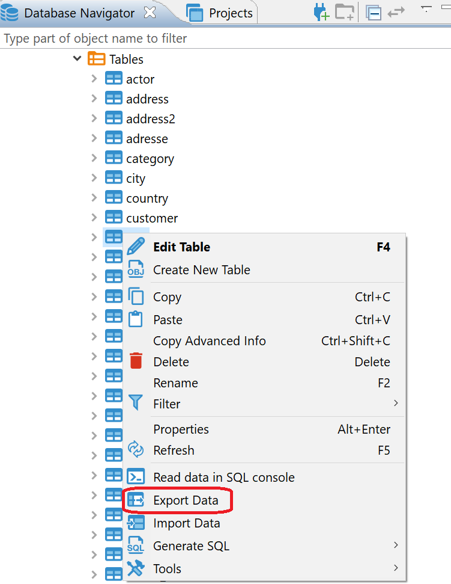

2. Choose export format. DBeaver support many different output formats including CSV, HTML, XLSX, etc:
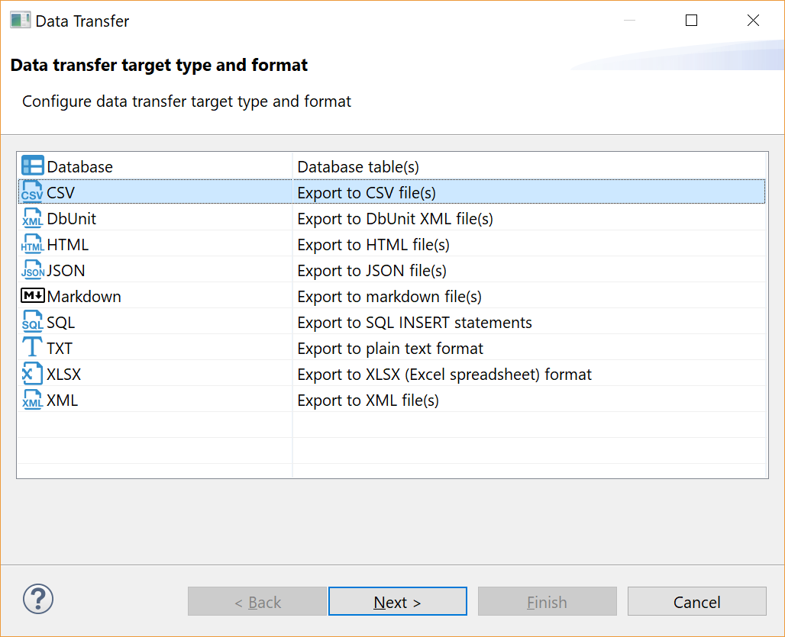

3. Set data extraction options (how data will be read from tables). This may affect extraction performance:
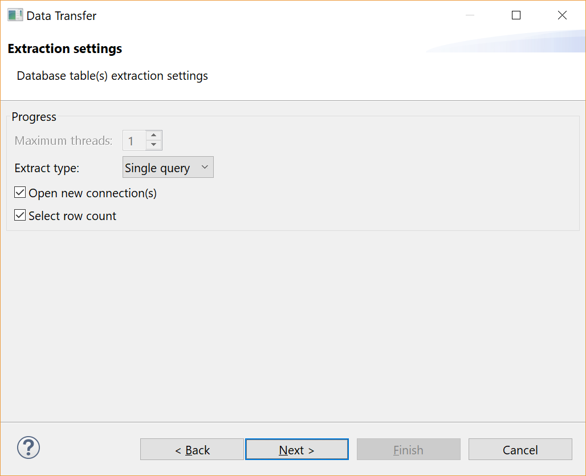

4. Set export format option. They are specific to the data format you chose on step 2:
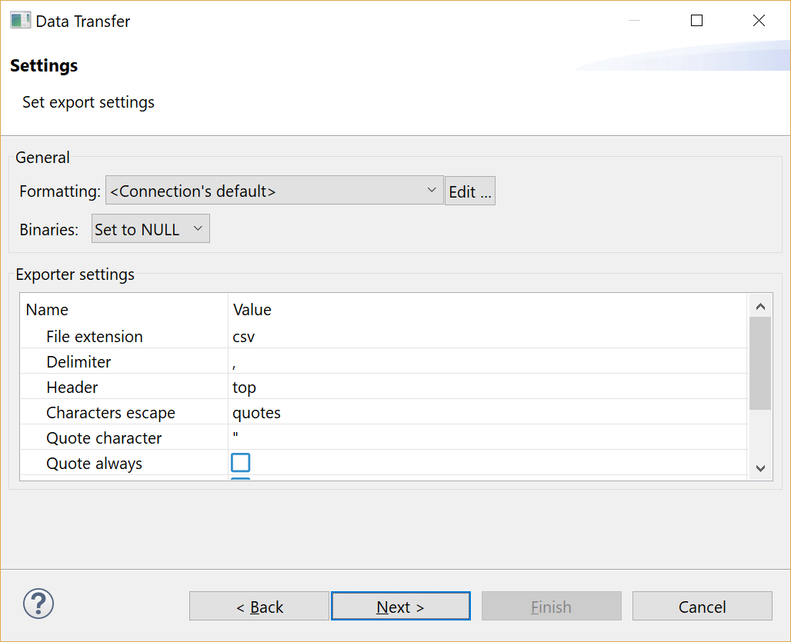

5. Set options for output files or clipboard:
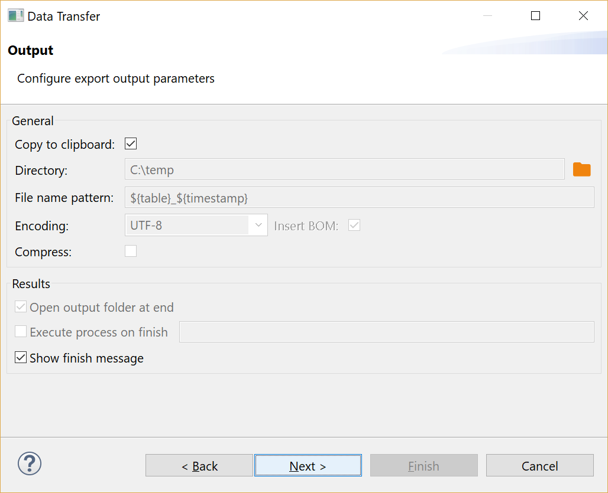

6. Review what and to what format you will export:
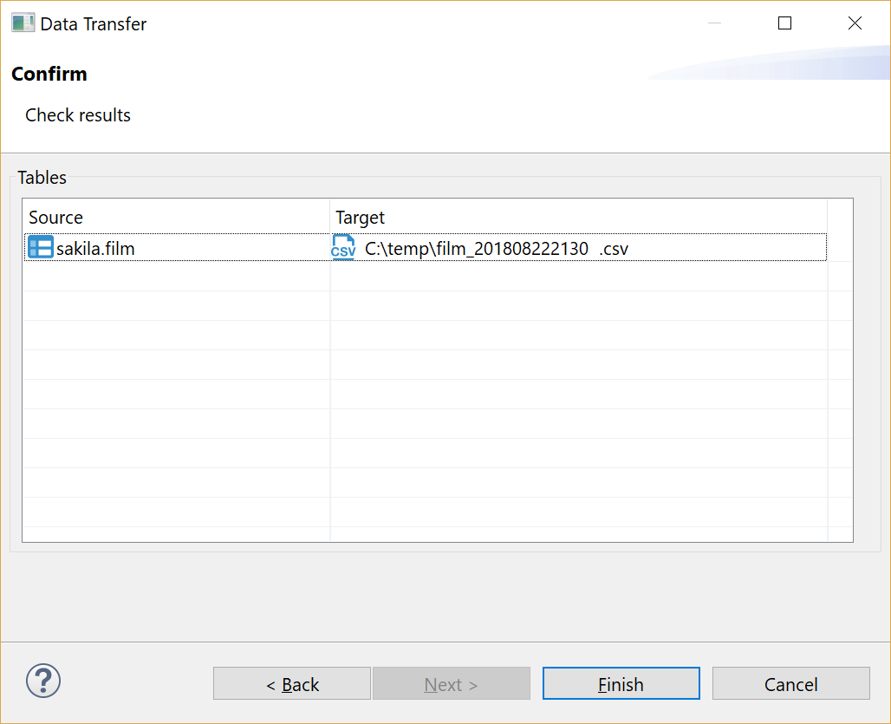

7. Press finish. See extraction progress. Actual data extraction will be performed in background, you can keep working with your database during export process.
Note: avoid changing data in tables you selected for export while export is running.
In the end you will see status message:
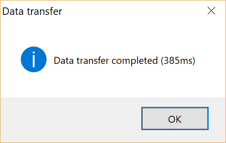

## Importing data from CSV format
You can import data from CSV file(s) directly into your database table(s).

1. Select a table(s) to which you want to import data. In the context menu choose "Import Data":
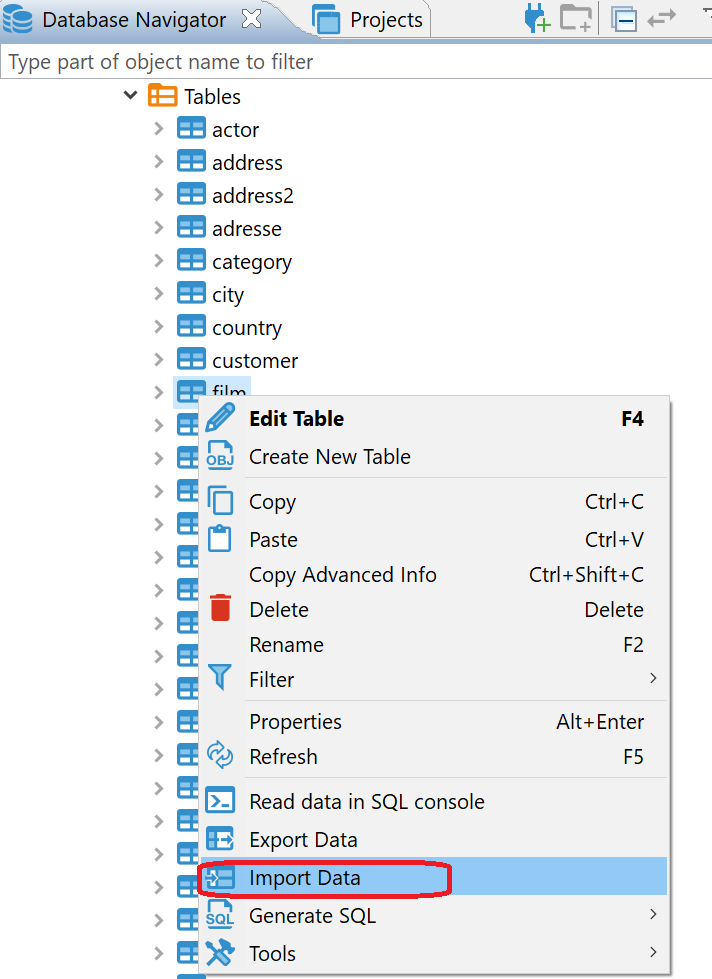

2. Choose import format (CSV):
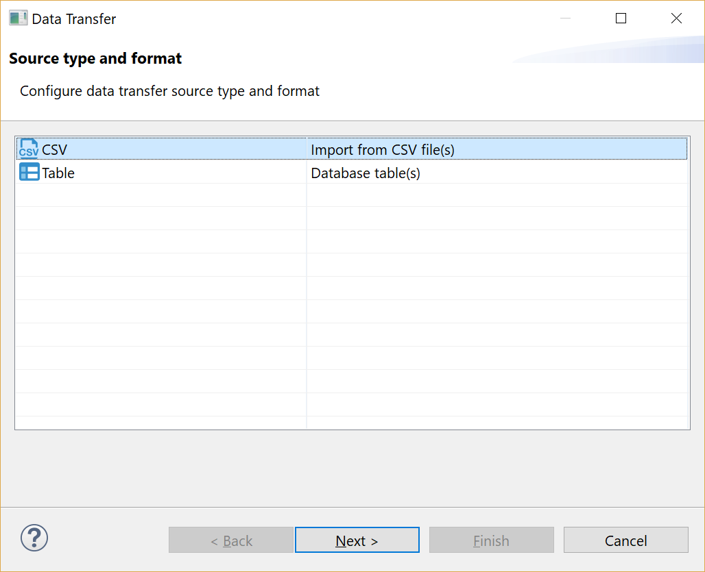

3. Select input CSV file for each table you want to import:
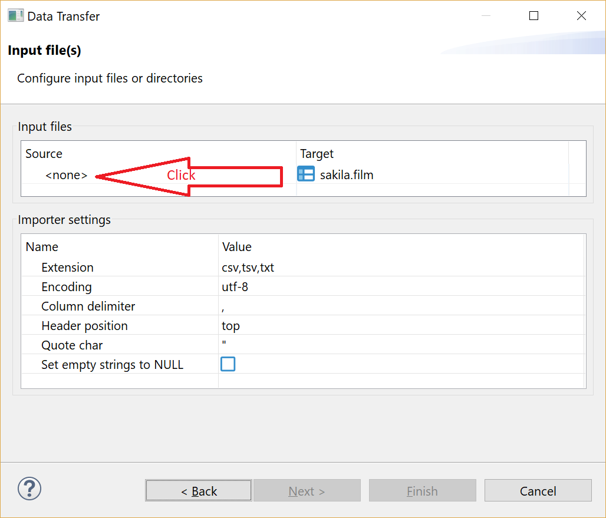

4. Set CSV-to-table mappings. 
You need to set some column in CSV file for each database table column.
You can skip some column at all (in target table column value will be set to NULL).
You can set some constant value for table column if there is no source column for it in CSV.
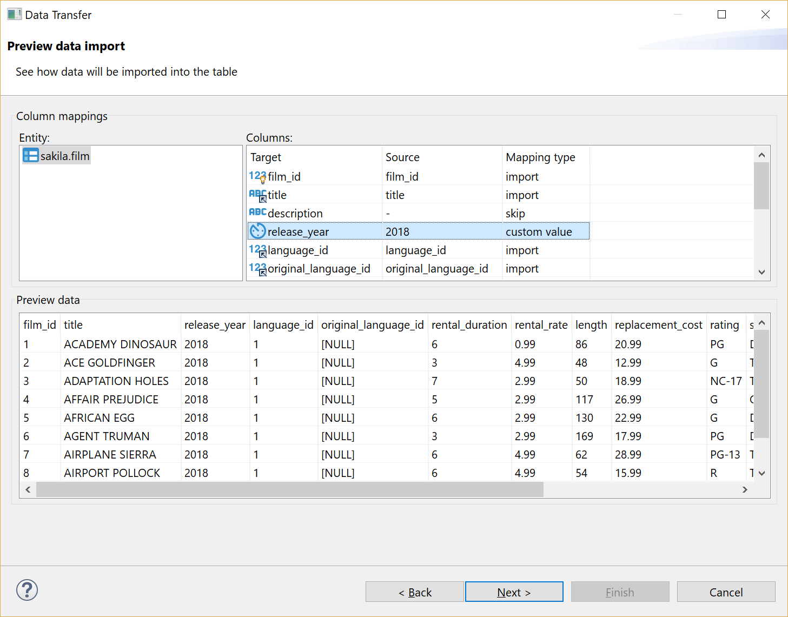

5. Set options for loading data in database. These options may affect performance:
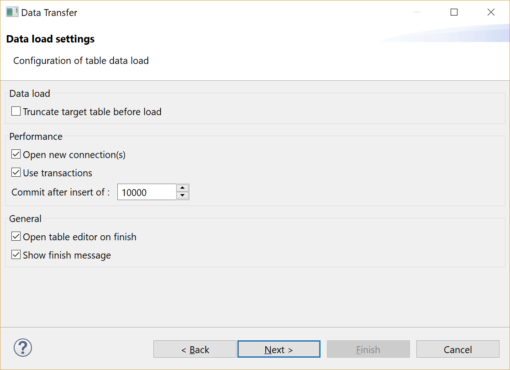

6. Review what file(s) and to what table(s) you will import:
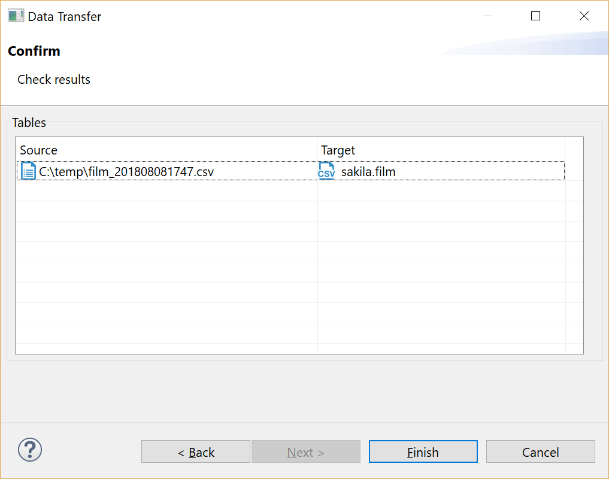

7. Press finish. See extraction progress. Actual data loading will be performed in background, you can keep working with your database during export process.
Note: avoid changing data in tables you selected for import while import is running.
In the end you will see status message:

## Migrating table(s) data to another database table(s)

