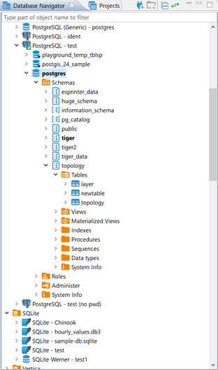

Database Navigator is the main view to work with the structure and content of databases. To open Database Navigator, on the Windows menu, click **Database Navigator**. For information on how to change the view layout, please see the [Application Window Overview](https://github.com/dbeaver/dbeaver/wiki/Application-Window-Overview) article.

Database Navigator contains a tree of objects, a toolbar and View menu which contain generic items. Each object in the tree has its own context menu.
The tree contains the following objects:
* Folders - 
* Database connections -  and other (icons differ depending on the database type)
* Database objects - various depending on the database type, such as Tables , Views , Columns  , Indexes , etc.

To open the view menu of Database Navigator, click the View Menu button () in the upper-right corner of the window. 
For more information on where to find the view toolbar and menu, please see the [Views](https://github.com/dbeaver/dbeaver/wiki/Views) article.

The menu contains the following items:

Icon|Menu item|Description
----|---------|-----------
 |**Driver Manager**|Opens the Driver Manager window that allows creating, editing and deleting drivers for databases. See [Database Drivers](https://github.com/dbeaver/dbeaver/wiki/Database-drivers) for information about managing database drivers.
 |**New Connection**|Opens the Create new connection wizard. See [Create Connection](https://github.com/dbeaver/dbeaver/wiki/Create-Connection) for information about creating connections.
(empty) | **Active Project** |Displays a submenu which allows you to choose a project. See [Projects](https://github.com/dbeaver/dbeaver/wiki/Projects) and [Projects view](https://github.com/dbeaver/dbeaver/wiki/Projects-View) for information about projects.
 |**New Folder** |Opens a dialog box for creating a new folder
 | **Collapse All** |Collapses the tree to the root level
 | **Link with editor** | Enabled when at least one editor is open, otherwise disabled - highlights the object in the tree that has its editor open

The toolbar is located in the title bar of the window. Its buttons duplicate the menu items, except for the **Active Project**. 

To open the context menu for an object, right-click the object in the tree. The following table summarizes context menu items for all types of objects that may appear in the tree. Note that the presence or absence of context menu items for an object depends on the database and object types.

Menu item|Description
---------|-----------
**Open folder**|Opens a folder in a separate view
**Create new connections / Create New Connection**|Opens the Create new connection wizard
**New Folder**|Opens a dialog box for creating a new folder
**Copy**|Copies an object to the clipboard 
**Paste**|Inserts the copied object into a selected folder - most convenient for copy-pasting connections
**Delete**|Deletes an object  **WARNING!** The Delete menu item removes the object not only from the tree but from the database itself or the file system, and this action is irreversible. 
**Rename**|Opens the Rename [object] dialog box
**Properties**|Opens the Properties for [object] window which allows viewing and modifying the object`s properties
**Refresh**|Depending on the object, refreshes the object itself, or its parent, or its subnodes – mostly used for refreshing tables and schemes
**Connect**|Attempts to connect to the database
**Invalidate/Reconnect**|Checks the status of connection, if it is broken, attempts to reconnect
**Disconnect**|Disconnects from the database
**SQL Editor**|Opens a new SQL editor for the connection
**Recent SQL Editor**|Opens the most recently opened SQL editor
**Edit Connection**|Opens the Connection Configuration window that allows configuring connection settings
**View [objects]**|-	For objects that DBeaver can create and delete, opens the object in a separate editor -	For objects that DBeaver cannot create and delete, opens the object in a separate viewer
**Edit [object]**|-	For objects that DBeaver can create and delete, opens the object in a separate editor -	For objects that DBeaver cannot create and delete, opens the object in a separate viewer
**Create new [object]**|Opens an editor in which you can specify properties and save the new object
**Filter**|Opens a submenu of one or more filtering options (depending on the object): -	Hide [object] -	Show only [object] -	Configure [objects] filter -	Toggle filter -	Clear filter  See [Filters](https://github.com/dbeaver/dbeaver/wiki/Filter-Database-Objects) for information.
**Copy Advanced Info**|Copies the full name of an object
**Read Data in SQL Console**|Opens an SQL console displaying the object`s data
**Copy Advanced Info**|Copies the full name of an object
**Read Data in SQL Console**|Opens an SQL console displaying the object`s data
**Compare**|- Appears only if you select several objects of the same level  - Opens the Compare objects wizard which guides you through the steps to generate a comparison report for the selected objects
**Generate SQL**|Opens a submenu on which you can select the type of SQL query to generate: - SELECT - INSERT - UPDATE - DELETE - MERGE - DDL  Clicking one of the items (for example INSERT) generates a relevant query in a separate window.
**Export Table Data**|Opens the Data Transfer wizard that helps you select a format and export table data 
**Import Table Data**|Opens a window with existing database connections in which you can select a table to import data from 
**Tools**|Opens a submenu that provides tools for database backup and restore, vacuum, etc.

For information on how to filter database objects in Database Navigator, please see the [Filter Database Objects](https://github.com/dbeaver/dbeaver/wiki/Filter-Database-Objects) article.
