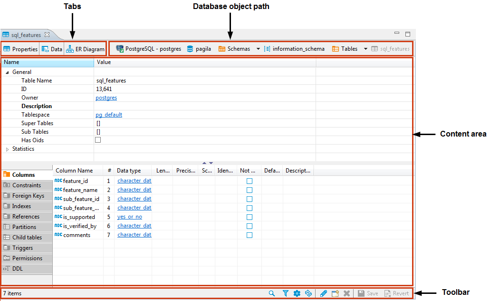

The Database object, or metadata, editor is available for multiple database objects such as tables, views and schemas. To open the metadata editor for an object, in the [Database Navigator](https://github.com/dbeaver/dbeaver/wiki/Database-Navigator) or in the [Projects](https://github.com/dbeaver/dbeaver/wiki/Projects) view:
* Double-click the database object
* Click the database object and press <kbd>Enter</kbd> or <kbd>F4</kbd>

The editor has three tabs:
* **Properties** tab appears for all objects, contains properties of the database object and its sub-entities, see further in this article 
* **Data** tab appears for tables and views and represents the [Data Editor](https://github.com/dbeaver/dbeaver/wiki/Data-Editor)
* **ER Diagram** tab appears for tables and schemas and displays ERD (Entity Relation Diagrams), see [ER Diagrams](https://github.com/dbeaver/dbeaver/wiki/ER-Diagrams) and [Database Structure Diagrams](https://github.com/dbeaver/dbeaver/wiki/Database-Structure-Diagrams)

The tabs have the following common parts:

The object`s path shows the chain of all its parent entities. The entities are clickable: clicking an entity in the path, depending on its nature, either shows its children or opens an editor or a settings window.

The toolbar contains different tools on each of the three tabs.

An asterisk appears in the title of an editor if it contains unsaved changes:

The Database Object editor supports the <kbd>Ctrl+Z</kbd> (undo) function.