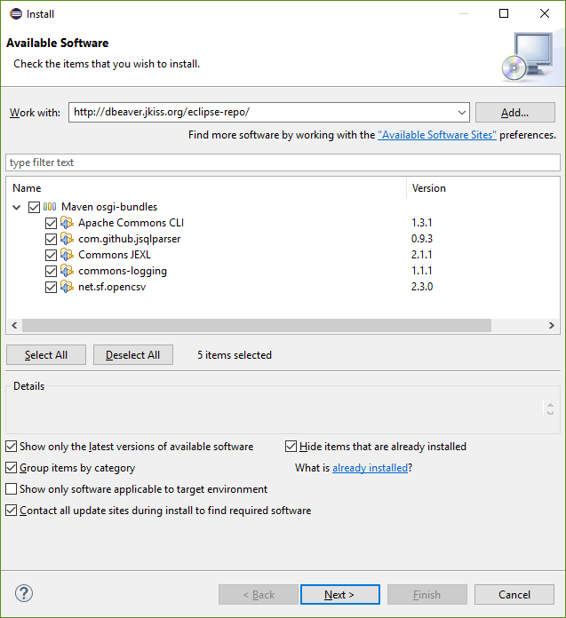

DBeaver is an [Eclipse RCP](https://wiki.eclipse.org/Rich_Client_Platform) application.  
It consists from a set of Eclipse plugins, features and products.

##### Sources structure:
- `docs` - some documentations (mostly outdated)
- `features` - feature descriptors. Doesn't contain any source code. Used to structurize product plugins/dependencies.
- `bundles` - very base plugins (like utils)
- `plugins` - main sources location
  - `org.jkiss.dbeaver.model` - model API and base classes. Doesn't contain any UI dependencies, just pure data model.
  - `org.jkiss.dbeaver.core` - main DBeaver module. Most of base UI classes are here.
  - `org.jkiss.dbeaver.core.application` - relatively small module which configures standalone DBeaver application.
  - `org.jkiss.dbeaver.core.eclipse` - main Eclipse plugin. Adds some extra menus/views to standard Eclipse IDE.
  - `org.jkiss.dbeaver.ext.*` - DBeaver extensions
- `product` - final products (standalone and Eclipse plugin) configuration.

##### Opening workspace in Eclipse

You will need to setup "<a href="https://www.eclipse.org/downloads/packages/eclipse-rcp-and-rap-developers/oxygen1a">Eclipse for RCP and RAP developers</a>". Currently default Eclipse version is Oxygen (4.7). Build may fail on newer or older versions.  
Then you will need to install a few additional Eclipse plugins which DBeaver depends on (and which are not included in the standard Eclipse distribution):
- Open main menu Help -> Install New Software
- Copy `http://dbeaver.io/eclipse-repo/` into "Work with" field and press enter

- Check all plugins and finish the installation process

Now you need to checkout DBeaver repository with `git clone https://github.com/dbeaver/dbeaver.git` command.
In Eclipse create a new workspace and run Import wizard. Choose "General->Existing projects into Workspace".  
Select DBeaver checkout directory as root a directory. Check all plugins and features Eclipse will find and finish the wizard.  

Now you can build DBeaver (`Ctrl+B`).
To run the standalone version find file `DBeaver.product` (it is located in `product/standalone` directory). Open it and click on "Launch an Eclipse application" or "Launch an Eclipse application in Debug mode".  

If product won't start with `No application id has been found` error try this workaround:
https://stackoverflow.com/questions/13575695/eclipse-rcp-no-application-id-has-been-found  
> What you need to do is go to your Run Configurations (Run -> Run Configurations). Select the Plug-ins tab and then hit "Add Required Plug-ins". Apply, then Run, and it should work now.

That's it.

##### Notes:
Everything above covers Community Edition version.  
