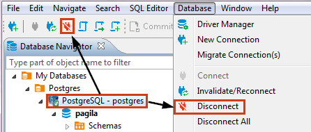

You might need to disconnect from a database to free up resources or close transactions. To disconnect from a database, in the [Database Navigator](https://github.com/dbeaver/dbeaver/wiki/Database-Navigator) or [Projects](https://github.com/dbeaver/dbeaver/wiki/Projects) view, click the connection and then click the Disconnect button in the toolbar or click **Database -> Disconnect** on the main menu:

You can also right-click the connection and click **Disconnect** on the context menu.

NOTE: The Disconnect button and menu items are available only for those connections that are activated, that is, marked with the connected sign: .

When DBeaver disconnects from a database, its icon changes to its original state (not connected), for example,  for PostgreSQL database.

To disconnect from all active connections, click **Database -> Disconnect All** on the main menu.