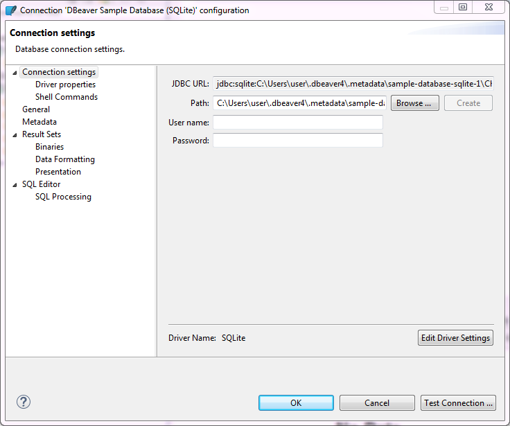

To edit configuration settings of a database connection, in the [Database Navigator](https://github.com/dbeaver/dbeaver/wiki/Database-Navigator) or in the [Projects](https://github.com/dbeaver/dbeaver/wiki/Projects) view, right-click the connection and click **Edit Connection** on the context menu. The Connection configuration window opens:

The navigation pane on the left displays configuration sections, most of which are the same as those in the Create new connection wizard, see [Connect to Database](https://github.com/dbeaver/dbeaver/wiki/Connect-to-Database). There are additional configuration sections as well, such as **Result Sets** and **SQL Editor**. Click the section name to open the configuration settings for editing.

You can test if your connection works with modified settings - click **Test Connection**. When you finish editing your connection, click **OK** to save the changes or **Cancel** to discard them.

## Driver settings

* In development

[[JDBC Time Zones]]