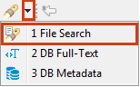
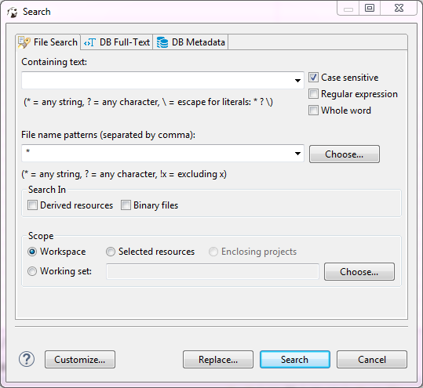
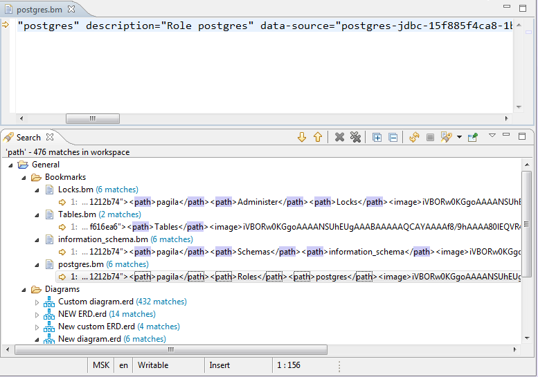

To search file contents for a string, click the Search button in the main toolbar or the arrow next to the Search button and then **File Search** on the dropdown menu:

The Search window opens displaying the File Search tab:

You can apply case sensitive search, search by regular expressions, search among particular file types (**File name patterns** field), and use the find and replace function.

After you click **Search**, the results appear in a [Search](https://github.com/dbeaver/dbeaver/wiki/Search) view. The results represent a tree or list of files with the search combination highlighted:

The toolbar of the Search view for File search provides more tools in addition to those available for all search types:

Button|Name|Description
------|----|-----------
|**Show Next / Previous Match**|Open the file in a separate viewer and move the highlight to the next/previous match, respectively
|**Remove Selected Matches**|Removes selected row (row in focus) of the results
|**Remove All Matches**|Removes all results in the view
|**Expand/Collapse All**|Expand/collapse the tree of results

The view also provides a view menu (click the **View Menu** button () in the upper-right corner of the view) that contains the following items:

Menu item|Description
---------|-----------
**Show as List**|Presents the results in the form of list
**Show as Tree**|Presents the results in the form of tree
**Filters**|Opens Search Filters dialog box
**Preferences**|Opens the Preferences window on the Search page

Double-clicking a results row opens it in a separate viewer.
