### New Table creation
* Set focus to "Tables" in the Database Navigator, select 'Create New Table' from right click.
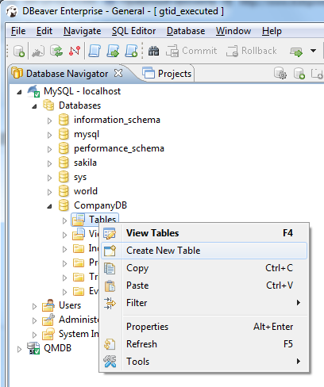
* New table is created with the default name "newtable". Go to 'Properties' tab to rename it
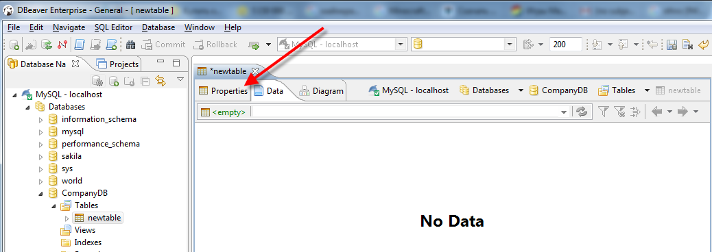
* As soon as you set the Table Name (1), move to 'Columns' tab (2)
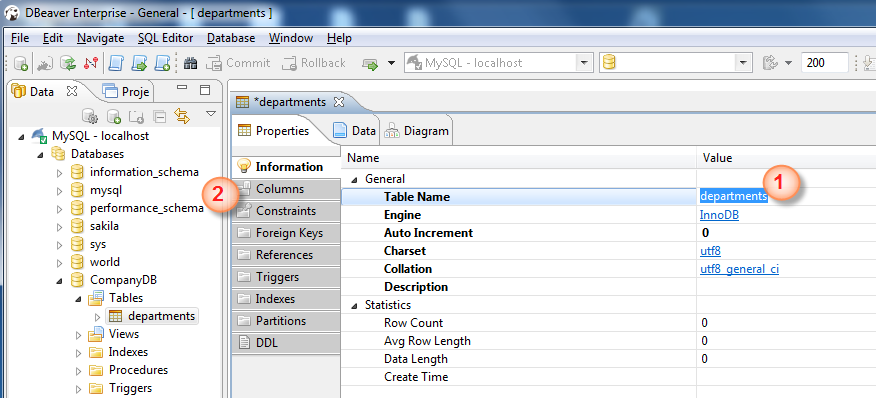
* Right click on the Column screen, select 'Create New Column'
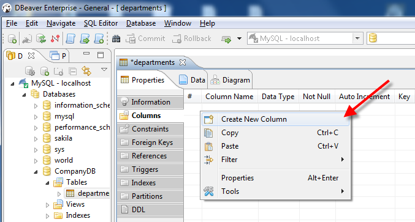
  
BTW: Another way to add a new column: to expand the table view in Navigation pane (1) and 'Create New Column' from right click menu (2)
  
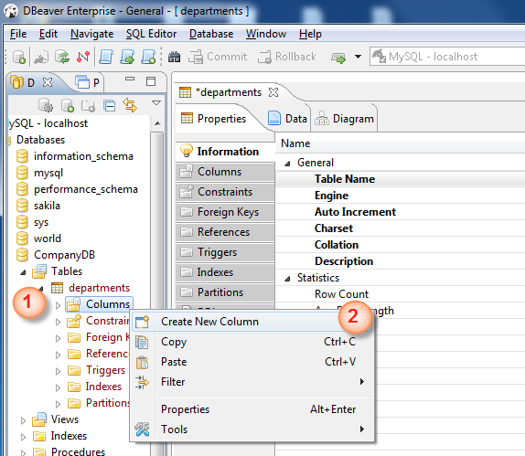
* New column is created with default column name and Data Type. Adjust the column properties as you wish.
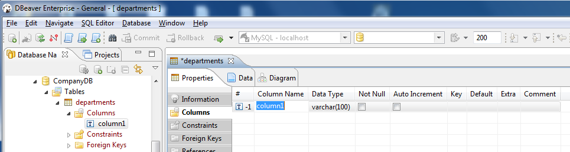
 
BTW: To tick checkbox (e.g. "Not Null") click the field and select "yes" from the dropdown list 
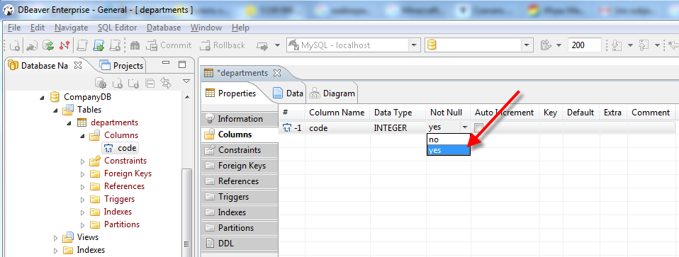

* Add more columns
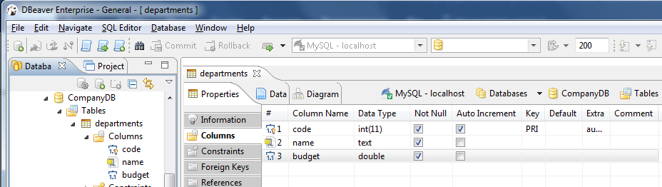

* Create the second table: right click menu on 'Tables' in Navigator -> Create New Table
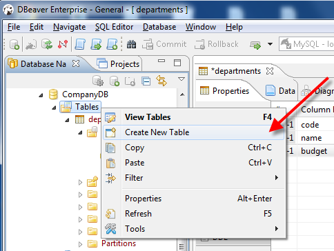, 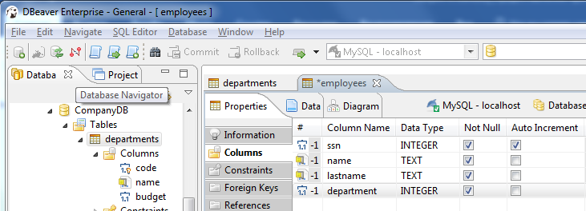

### Primary Key creation
* Move to 'Constraints' tab of the corresponding table, right click on the screen -> 'Create New Constraint'
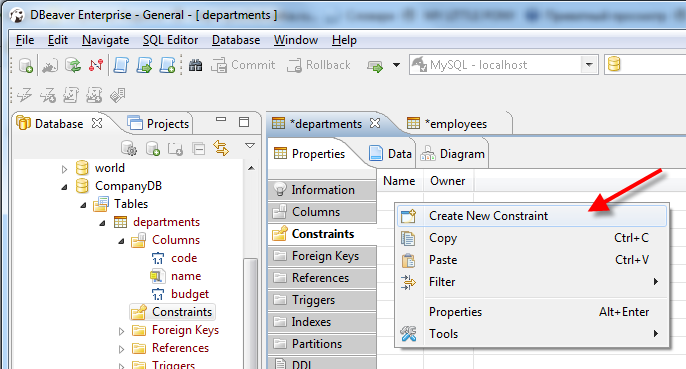
   
* Select the column (1)and save (2)
, 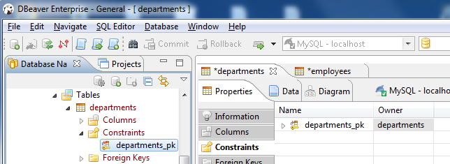

* **Save the tables**: select the table in Navigation pane (1) an press 'Ctrl+S' (or Top menu -> File -> Save, 'Persist' the changes (2).
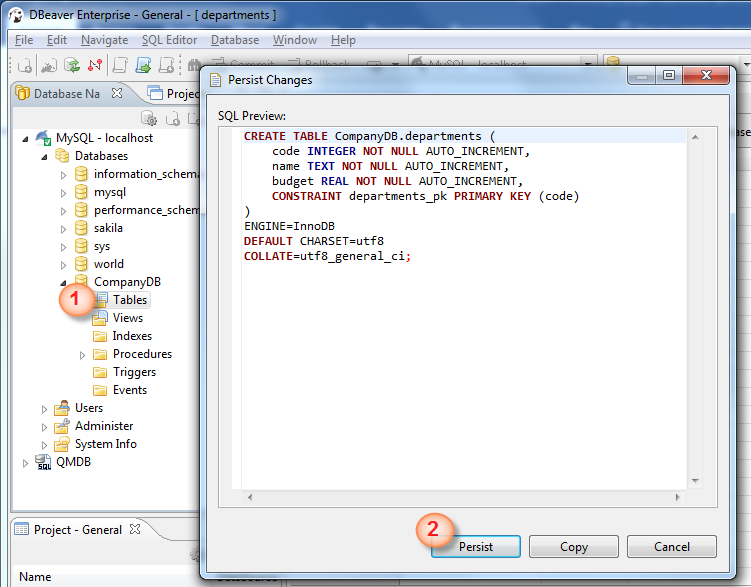, 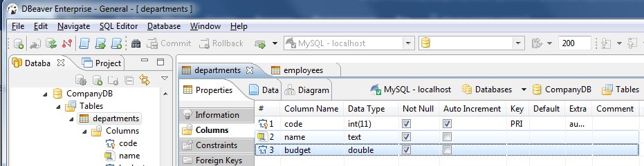

### Foreign Key creation
* Go to 'employees' table, 'Foreign Keys' tab. Right click on the screen -> Create New Foreign Key 
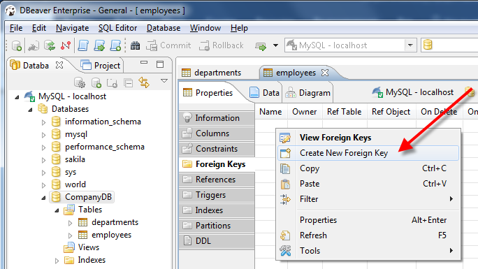, 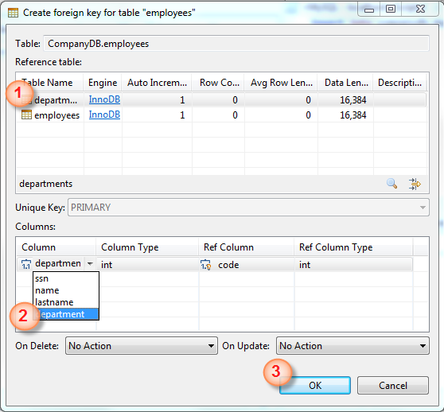