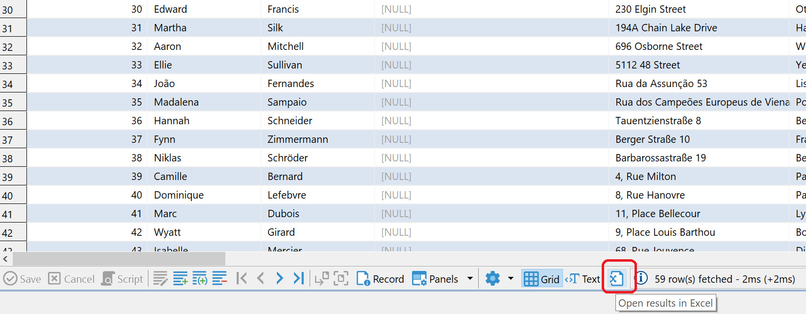
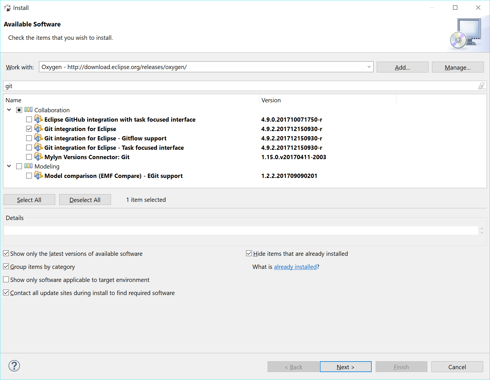

You can install optional extensions (plugins) in DBeaver.

## Install Process

### Extension installation in CE version:

1. Main menu `Help -> Install New Software`
2. Paste extension P2 repository URL into `Work with` field and press <kbd>Enter</kbd>
3. Check items you wish to install
4. Click Next->Finish. Restart DBeaver.

**IMPORTANT:** installation won't work if DBeaver is installed in write-protected folder (like `Program Files`, `/Applications`, `/usr/`). To proceed you need to run DBeaver from some non write-protected folder or run it as Administrator/root.

### Extension installation in EE

You can do this from online Eclipse Marketplace (open Marketplace UI from main menu).
OR you can install it manually the same way as in CE version (see above)

## Extensions

### Office integration

This extension supports data export in Office formats (XLS). IT works for all platforms and all popular Offices - MS Office, Open Office, Libre Office, MacOS X.  
It is included in EE version.  

Marketplace URL: https://marketplace.eclipse.org/content/dbeaver-office-integration  
P2 repository URL: https://dbeaver.io/update/office/latest/

  

### Debugger support

This extension supports SQL debugger in PostgreSQL.  
It is included in EE version.  

Marketplace URL: https://marketplace.eclipse.org/content/dbeaver-sql-debugger
P2 repository URL: https://dbeaver.io/update/debug/latest/

### SVG format support

This extension supports ERD export in SVG (vector) format.  
It is included in EE version.  

Marketplace URL: https://marketplace.eclipse.org/content/dbeaver-svg-support  
P2 repository URL: https://dbeaver.io/update/svg/latest/

### Advanced SSH tunnel libraries

Needed to support more key formats (e.g. ed25519).  

P2 repository URL: https://dbeaver.io/update/sshj/latest/

### Git integration

Choose Oxygen (or other Eclipse version item) in available items:
  
