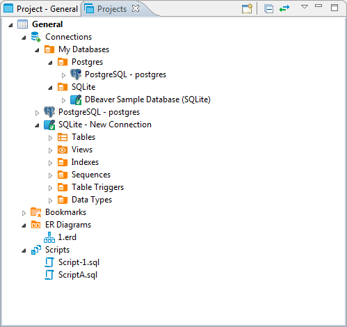

You might need to classify and group database connections into projects.  Projects store objects related not to a particular database but to all database connections. These are usually files stored on the file system.

The Projects view displays all projects created in the system and provides tools to manage them. To open the Projects view, on the **Window** menu, click **Projects** (or use <kbd>ALT+W+P</kbd> shortcut).

For information on how to change the view layout, please see the [Application Window Overview](https://github.com/dbeaver/dbeaver/wiki/Application-Window-Overview) article.

The projects are organized into a tree and all have the same high-level structure:
* **Connections** – repeat the content of the Database Navigator view for this project. You can perform the same actions over the objects of the databases as in Database Navigator.
* **Bookmarks** – contains bookmarks – shortcuts to database objects, see … 
* **ER Diagrams** - contains ER diagrams that you can drag-and-drop here from other folders
* **Scripts** – contains scripts that you can drag-and-drop here from other folders

The Projects view provides a toolbar and View menu which contain generic items. Each object in the tree has its own context menu.

To open the view menu of the Projects view, click the View Menu button () in the upper-right corner of the window. The view menu contains the following items:

Icon|Item|Description
----|----|-----------
|Create Project|Opens the Create Project wizard
|Refresh Projects|Refreshes the projects tree to display changes caused by creating modifying or deleting projects 
|Collapse All|	Collapses the tree to the root level
|Link with editor|- Enabled when at least one editor is open, otherwise disabled - Highlights the object in the tree that has its editor open

The toolbar is located in the title bar of the window, its buttons duplicate the view menu items except for the **Refresh Projects** one.

To open the context menu for an object in the tree, right-click the object.
For information about context menu items of all objects under the **Connections** node of the tree, please see [Database Navigator](https://github.com/dbeaver/dbeaver/wiki/Database-Navigator).  The context menus of other nodes in the tree contain some basic items for copy-pasting, renaming, deleting objects, managing their properties, creating folders, etc.
* The **Set Active Project** menu item (for a project root node) makes the project active, that is visible in the Database Navigator. 
* The **Link File (SQL Script)** and **Link Folder** menu items allow creating links to files and folders in the file system.

For information about managing projects, please see [Projects](https://github.com/dbeaver/dbeaver/wiki/Projects) article.