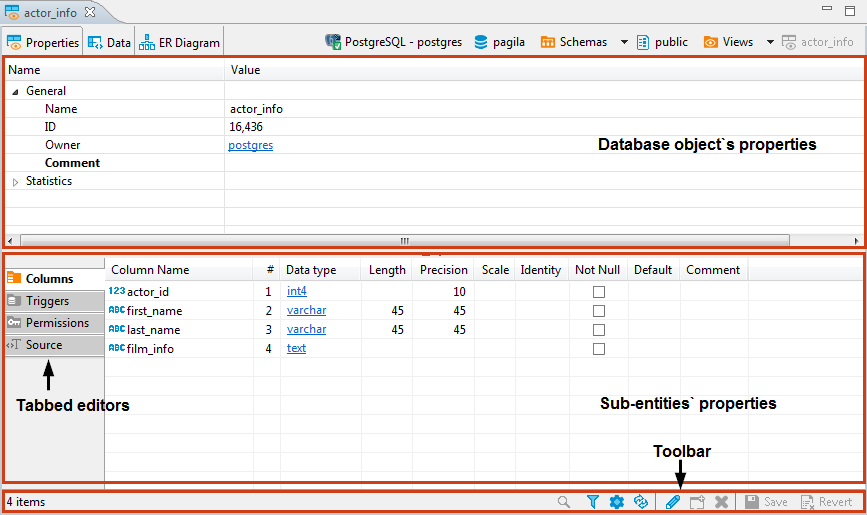

The Properties tab of the [Database Object Editor](https://github.com/dbeaver/dbeaver/wiki/Database-Object-Editor) provides tools to view and edit the database object`s properties.

The content area of the Properties tab falls into two parts: the top pane displays properties of the current database object itself while the bottom pane contains properties of the object`s sub-entities or some complex properties like DDL (an SQL description of the current database object).

Properties of sub-entities appear in side tabbed editors – to open such an editor, click the tabs on the left side of the area:

The top pane can be wrapped to the **Information** side tab appearing together with sub-entity tabs on the left. To do so, click the Move properties to tab / Detach properties to top panel button () in the toolbar:

The toolbar at the bottom of the editor provides the following tools for the majority of sub-entities except for some specific ones like Permissions (in PostreSQL) or SQL based views (DDL and Source):

Button|Name|Description
------|----|-----------
|Search items|Displays a search field next to the button: - Type in the search combination - the content updates dynamically - To remove the filter, click the cross icon next to the search field
|Filter settings|Opens the Filtering window which allows setting a custom filter, see [Configure Filters](https://github.com/dbeaver/dbeaver/wiki/Configure-Filters)
|Configure columns|Opens the Configure columns dialog box in which you can select the columns to display or hide in the current view
|Refresh the selected items|Depending on the database type, refreshes either the current item or its parent or the whole database object – reloading data from the database
|View|Opens an editor/viewer for the item currently in focus
|Create new [items]|Creates a new item of the same type as currently displayed in the open view, for example, a column
|Delete database object|Deletes the item currently in focus
|Save the current contents|- Same as the **Save** button on the application main toolbar - Same as <kbd>Ctrl+S</kbd> - Opens the **Persist Changes** window that allows saving changes in the currently open sub-entity NOTE: DBeaver recommends saving work after each change.
|Revert to the last saved state|Reverts all changes made to the whole database object to the last saved state

Items in the tabbed editors have context menus which provide the same commands as those in the [Database Navigator](https://github.com/dbeaver/dbeaver/wiki/Database-Navigator). To open a context menu for an item, right-click the item.

## SQL Script Editors
SQL script editors (**DDL** and **Source**) of the Properties tab contain SQL script that you can either view or modify.
The toolbar of the DDL and Source tabs provides the following tools:

Button|Name|Description
------|----|-----------
|Load form file|- Allows selecting a file from the file system - Disabled if the SQL code is read-only
|Save to file|Allows saving the current SQL code to a file
|Open in SQL console|Opens the SQL code in an SQL Editor

You can select parts of the SQL code and apply generic commands such as copy-paste or SQL-specific commands like formatting – using the context menu. To open the context menu, right-click the SQL code. See [SQL Editor](https://github.com/dbeaver/dbeaver/wiki/SQL-Editor) for information about SQL-specific commands.

NOTE: **SQL Assist**, **SQL Template**, and **SQL Context Information** menu items on the context menu are disabled if the SQL script is read-only.