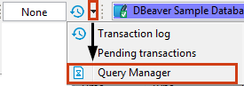
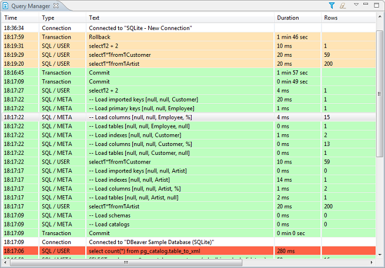
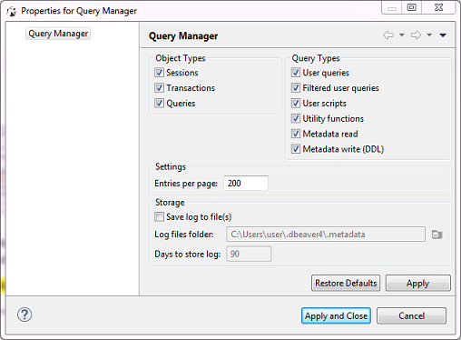

Query Manager is a view that shows the history of all SQL queries that DBeaver has executed during the current session.

NOTE: DBeaver EE version persists all executed queries in the internal database so execution history is available after the program restart.

To open the Query Manager, do one of the following:
* Click the arrow next to the **Transaction Log** button in the toolbar and then click **Query Manager** on the dropdown menu:

  

* On the **Window** menu, click **Show View -> Query Manager**:

  

The Query Manager logs all queries together with their execution statistics (execution time, duration, number of fetched/updated rows, errors, etc.):

You can modify the look of the Query Manager by filtering queries and setting the number of entries displayed per page as well as you can specify some storage settings, see the ‘Query Manager Properties’ section below.

To erase all entries from the Query Manager, click the **Clear query manager log** button () in the view`s toolbar.

### Query Manager Properties
To manage the look of the Query Manager, filter the entries, and modify storage settings, click the **Set query manager filter** button () in the view`s toolbar. The Properties for Query Manager window opens:

* To filter entries by object type, select or clear the checkboxes in the **Object Types** section. To filter entries by query type, select clear the checkboxes in the **Query Types** section.
* To change the number of entries displayed per page, enter the new number in the **Entries per page** field.
* To set DBeaver to save the query log in a file, select the **Save log to file(s)** checkbox and then specify the file location in the **Log files folder** field.

After you make all necessary changes to the settings, click **Apply** to apply the changes and keep the window open or click **Apply and Close** to apply the changes and close the window. To discard all changes and return to the previous state, click **Restore Defaults**. 
