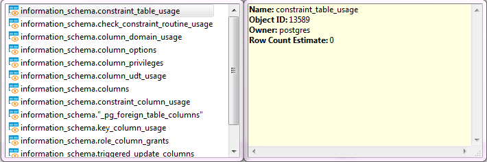

The SQL Assist feature provides auto-completion of database object names and SQL commands and other keywords in queries.
 
To perform some object name auto-complete, press <kbd>Ctrl+Space</kbd> or right-click the required place in the query and click **SQL Assist** on the context menu. DBeaver searches for potentially suitable objects in already loaded database metadata and in the database system tables. 

When you start typing an SQL keyword in a statement, DBeaver offers auto-complete options as well.  
Another auto-complete function is search for completion only within already entered identifiers - press <kbd>Ctrl+Shift+Space</kbd>.  