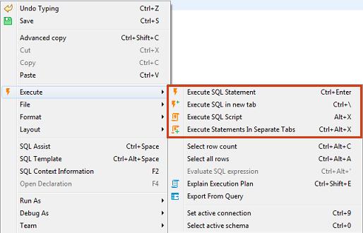
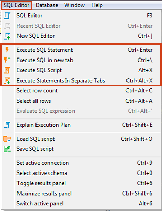
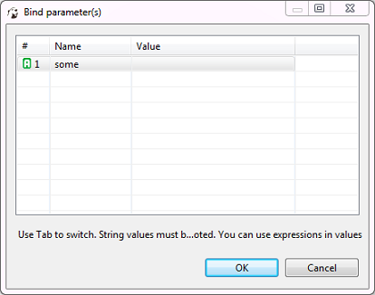
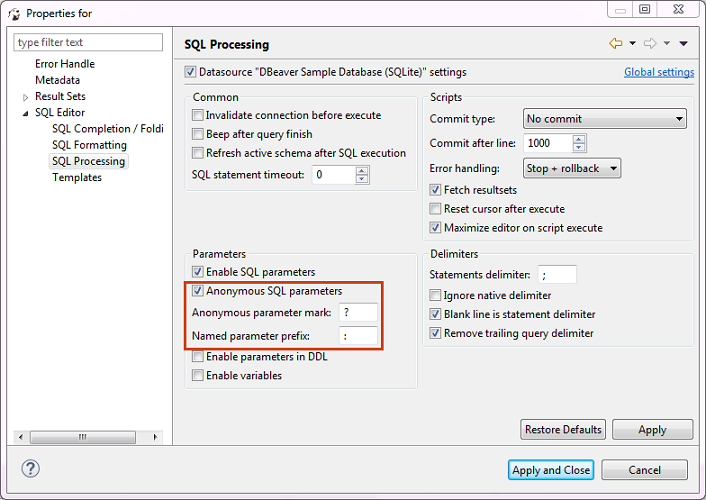
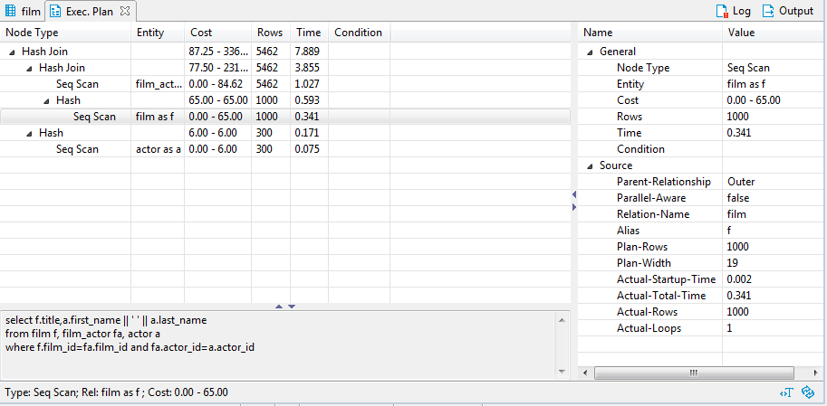
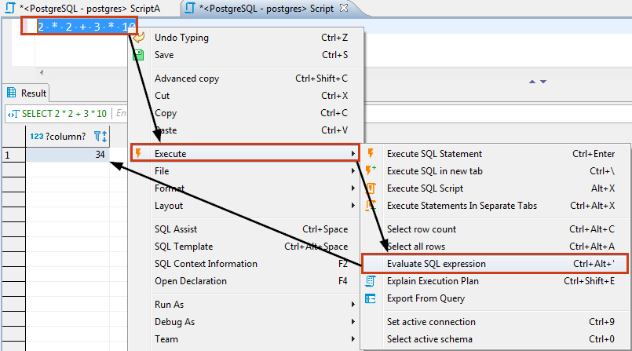
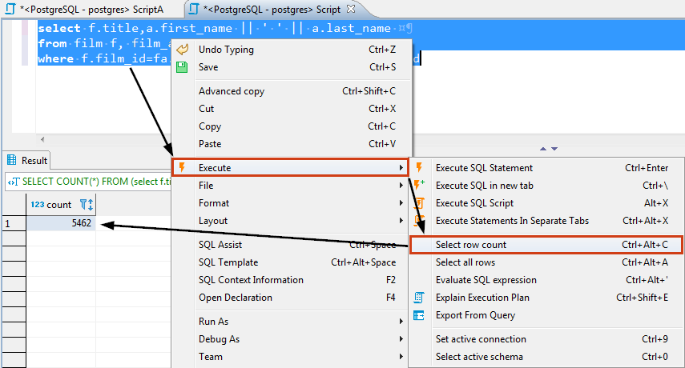
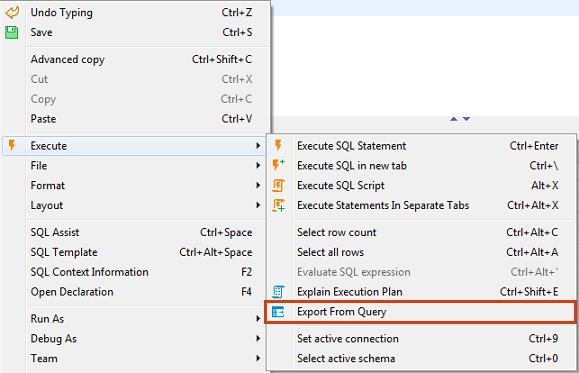
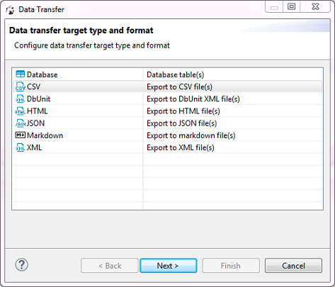

You can execute one query, a highlighted portion of a script, or a whole script. You can execute them using:
* Shortcut key combinations (see details further in this article)
* Tools in the main toolbar: 
* Context menu (right-click the query):

  

* DBeaver main menu:
 
  

To execute a query under cursor or selected text, press <kbd>Ctrl+Enter</kbd> or right-click the query and click **Execute -> Execute SQL Statement** on the context menu. You can do the same using the main toolbar or main menu: **SQL Editor -> Execute SQL Statement**. This executes the SQL query under cursor or selected text and fills the results pane with the query results.

To execute a query under cursor in a separate tab, press <kbd>CTRL+\ </kbd> or right-click the query and click **Execute -> Execute SQL in new tab** on the context menu. The same can be done using the main toolbar or the main menu: **SQL Editor -> Execute SQL in new tab**. This executes the SQL query under cursor or selected text and creates a new results tab.

To execute the whole script, press <kbd>Alt+X</kbd> or click **Execute -> Execute SQL Script** on the context menu or **SQL Editor -> Execute SQL Script** on the main menu or in the main toolbar. This executes all queries in the current editor (or selected queries) as a script. DBeaver parses queries one by one using a statement delimiter (“;” by default) and executes them consecutively. You can configure the script execution behavior in the SQL editor preferences (Right-click the script and click **Preferences** on the context menu).

To execute a script opening each query results in a separate tab, press <kbd>Ctrl+Alt+Shift+X</kbd> or click **Execute -> Execute Statements In Separate Tabs** on the context menu or **SQL Editor -> Execute Statements In Separate Tabs** on the main menu or in the main toolbar. The executes all queries in the script, but opens multiple result tabs. Each script query is executed in a separate thread (that is, all queries are executed simultaneously).
NOTE: Be careful with this feature. If you execute a huge script with a large number of queries, it might cause unexpected problems. 

## Dynamic Parameter Bindings

You can use dynamic parameters in your SQL queries. The parameter format is :name. When you execute a query which contains dynamic parameters, DBeaver displays a dialog box in which you can fill the parameter values:

You can also use anonymous parameters (?), but you will need to enable them in SQL editor preferences:

You can open SQL editor preferences by pressing <kbd>Alt+Enter</kbd>.

## Execution Plan

If a database driver supports execution plan visualization, you can see the execution plan of the current query (under cursor) by pressing <kbd>Ctrl+Shift+E</kbd> or clicking **Explain execution plan** on the context menu or in the main toolbar: 
The execution plan command generates a tree of query execution as one of the result tabs and is convenient in estimating if the query/script is quick/optimal enough: 

You can click the rows of the execution plan to see their details (statistics) in the panels below and to the right of the plan.  
To reevaluate the plan, click the **Reevaluate** button ().
To see the source script on which the plan is based, click the **View Source** button ().

## SQL Expression Evaluation
To evaluate an SQL expression, right-click the expression and click **Execute -> Evaluate SQL expression** on the context menu. This command basically performs a query of **SELECT [expression] FROM DUAL** type:

## Row Count
If you want to know how many rows an SQL query will produce, you need to apply the Row Count feature – highlight and right-click the SQL text and then click **Execute -> Select row count** on the context menu:

## Query Export
It might be useful to export a query if you have a very long-running query and you do not need to see its results in the results panel. You can directly export the current query results to a file/table by right-clicking the query and then clicking **Execute -> Export From Query** on the context menu:

The Data transfer wizard opens. Go through its steps to complete the export of the query.

## Client-side commands

You can use special commands in SQL scripts.  
These commands are executed on DBeaver side, not on server-side.

Name|Description
----|-----
@set var = value|Sets default value for SQL parameter
@echo text|Prints string into server output viewer
@include file|Includes script file from file system

## Miscellaneous
* To select the current query row count, press <kbd>Ctrl+Alt+Shift+C</kbd>.
* To open the definition of the database object currently in focus (under cursor) in a viewer/editor, press <kbd>F4</kbd>.  