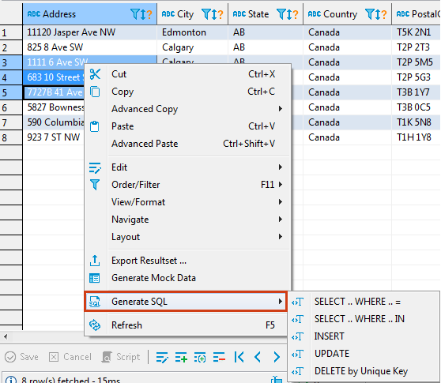
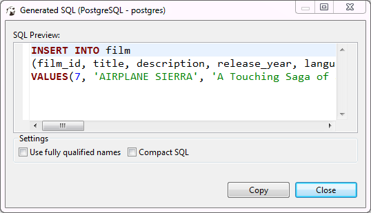
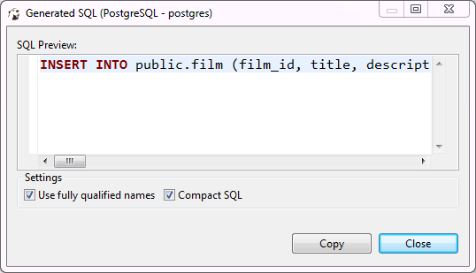

You can generate SQL statements (SELECT/INSERT/UPDATE/DELETE) based on selected rows. To generate SQL, right-click the selected rows and click **Generate SQL** and then one of the SQL commands on the context menu:

The SQL result opens in a separate window where you can view and copy it:

To use table names in the format '[schema name].[table name]', select the **Use fully qualified names** checkbox.  
To wrap the SQL query into one line, select the **Compact SQL** checkbox:

