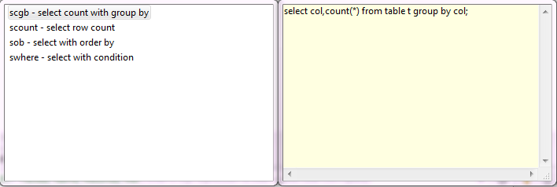

Templates allow you to insert frequently used SQL statements into an SQL script.

To see available templates, press <kbd>Ctrl+Alt+SPACE</kbd> or right-click the line in the script pane and click **SQL Template** on the context menu. A box appears with a list of available templates:

To apply a template, in the SQL Editor, in the script pane:
* Type the template name and press <kbd>Tab</kbd>
* Right-click the line where you want to insert a template expression, click **SQL Template** on the context menu, and then, in the list of templates, double-click the required template name.  
The template SQL statement appears in the script.
  
To edit/add/remove templates, click Configure () in the bottom toolbar, then click **Preferences -> SQL Editor -> Templates**. 
For more information about managing templates, please visit [Eclipse Website](http://help.eclipse.org/juno/index.jsp?topic=%2Forg.eclipse.jdt.doc.user%2Fconcepts%2Fconcept-editor-templates.htm).

#### [Standard Eclipse templates](http://help.eclipse.org/juno/topic/org.eclipse.jdt.doc.user/concepts/concept-template-variables.htm?cp=1_2_6_0):  

| Variable | Description |
-----------|-------------|
|${cursor} | Specifies the cursor position when the template edit mode is left. This is useful when the cursor should jump to different place than to the end of the template upon leaving the template edit mode. |
|${year} | Takes the current year value |
|${date} | Takes the current date value |
|${time} | Takes the current time value |
|${dollar} | Takes the dollar sign $. Alternatively, two dollar signs can be used: $$. |
|${user} | Takes the user name |
|${word_selection} | Takes the content of the current text selection |
|${line_selection} | Takes content of all currently selected lines

#### DBeaver-specific templates:  

| Variable | Description |
-----------|-------------|
|${schema} | Takes the current schema name |
|${catalog} | Takes the catalog name |
|${table} | Takes the current table name (from the active catalog/schema) |
|${column} | Takes the column name (from the current table) |

