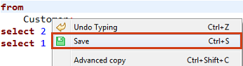
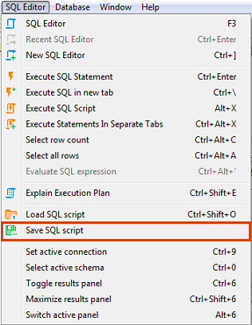
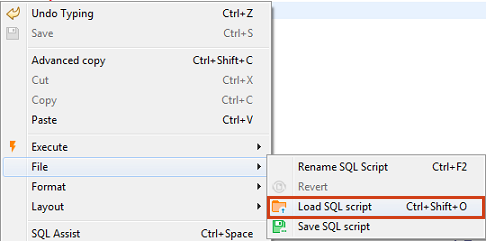
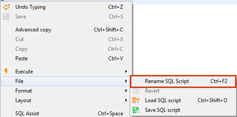
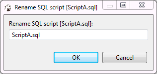

## Saving Scripts
You can save scripts to a predefined space in the currently active project or somewhere in the file system.

To save a script to the current project space, just press <kbd>Ctrl+S</kbd> or right-click the script and click **Save** on the context menu:

You can find the script saved this way in the [Project Explorer](https://github.com/dbeaver/dbeaver/wiki/Project-Explorer) view in the **Scripts** folder.

To save a script to the file system, right-click the script, click **File -> Save SQL script** on the context menu and then select the folder in the file system.  
You can also, click **SQL Editor -> Save SQL script** on the main menu:

## Loading Scripts
To load a script stored in the file system to the SQL Editor, press <kbd>CTRL+SHIFT+O</kbd>, or click **SQL Editor -> Load SQL script** on the main menu, or right-click the script panel and click **File -> Load SQL script** on the context menu:

## Renaming Scripts
To rename a script, right-click anywhere in the script panel, click **File -> Rename SQL Script** on the context menu or press <kbd>CTRL+F2</kbd>:

Then enter the new name in the Rename SQL script dialog box and click **OK**:

## Reverting Changes
If you want to revert all changes made to the current SQL script and return it to its initial state (reload from disk), right-click anywhere in the script panel and click **File -> Revert** on the context menu. 