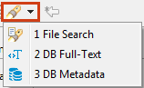
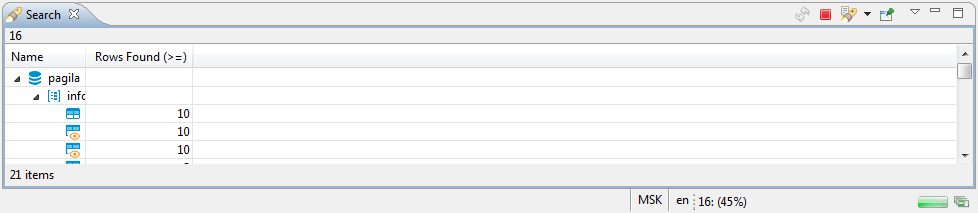
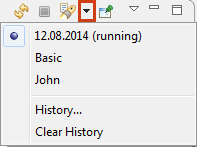

DBeaver provides:
* [File search](https://github.com/dbeaver/dbeaver/wiki/File-Search) (search among file contents)
* [Database full-text search](https://github.com/dbeaver/dbeaver/wiki/DB-Full-Text-Search)
* [Database metadata search](https://github.com/dbeaver/dbeaver/wiki/DB-Metadata-Search)

To use search, click the Search button in the main toolbar:

Please see dedicated articles for information about search of different types. This article describes common features of the three search types.

## Search View
Search results for any of the search types appear in a separate Search view. The following image shows the Search view for the database full text search:

The view contains a toolbar that provides common tools for all types of search as well as specific tools for the File Search type. The following are common tools:

Button|Name|Description
------|----|-----------
|**Run the Current Search Again**|Repeats the search the results of which are displayed in the Search view
/|**Cancel Current Search**|- Active state (red) indicates that the search is still in progress and appears if the search takes some time to complete. Clicking the button in this state stops the current search. - Inactive state (grey) indicates that the search is complete. The button in this state is non-actionable.
|**Show Previous Searches**|-	Clicking the button itself opens the Previous Searches window. - Clicking the arrow next to the button opens a dropdown menu. See the _Search History_ section further in this article.
|**Pin the Search View**|Ties the current search results to the Search view. If you click this button, the current results stay in the view while the results of the next search appear in a new Search view. Otherwise, every new search replaces the previous results with new results.

For information about specific tools of File search, see the [File Search](https://github.com/dbeaver/dbeaver/wiki/File-Search) article.

If the search is short, the results appear almost instantly. But if it takes some time, the Search view indicates the progress in the following ways:
* The **Cancel Current Search** button in the toolbar has the Active state ()
* The progress bar appears in the bottom-right corner of the view indicating the process:  
* The button to show the search progress in a separate view () appears in the bottom-right corner of the view next to the search progress bar. Clicking the button opens the Background Tasks view:

## Search History
DBeaver stores the history of search queries made during the current session. You can reopen the Search view with results of a previous search query. You can also remove individual queries and clear the history.
To manage the search history, use the **Show Previous Searches** button in the toolbar ().  
To open the results of a previous search query, do one of the following:
* Click the arrow next to the **Show Previous Searches** button in the toolbar and then click the query in the dropdown list:  
 
  

* Click the **Show Previous Searches** button itself or the arrow next to it and then **History** on the dropdown menu to open the Previous Searches window. Then, in the window, click the query and then either **Open** to open it in the active Search view or **Open in New** to open it in a new view:  

  
 
To remove one or more previous search queries:
1. Click the **Show Previous Searches** button in the toolbar or click the arrow next to it and then **History** on the dropdown menu. The Previous Searches window opens.
2. Click the query to remove or select several of them by clicking and simultaneously holding the <kbd>Ctrl</kbd> key.
3. Click **Remove**.

To clear the history by removing all previous queries, click the arrow next to the **Show Previous Searches** button in the toolbar and then click **Clear History** on the dropdown menu.

