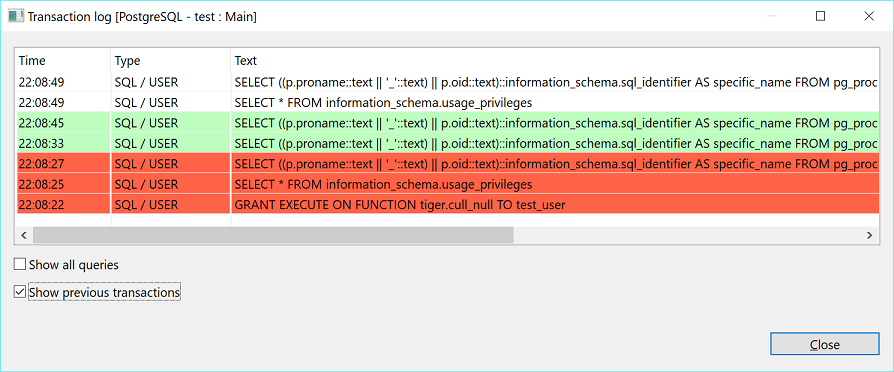

Transaction Log shows all transactions (queries of ‘transaction’ type such as INSERT/DELETE/UPDATE and others) made during the current DBeaver session. To open the Transaction Log, click the **Transaction log** button () in the toolbar or the statistics field to the left of it.

The Transaction Log window shows transactions that are:
* In progress or pending - shown without any special color
* Successfully committed – in green: 
* Rolled back – in orange or red: 

To see all previous transactions during the current session, select the **Show previous transactions** checkbox. To see all queries including non-transactional ones, select the **Show all queries** checkbox.
